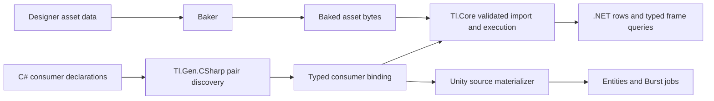
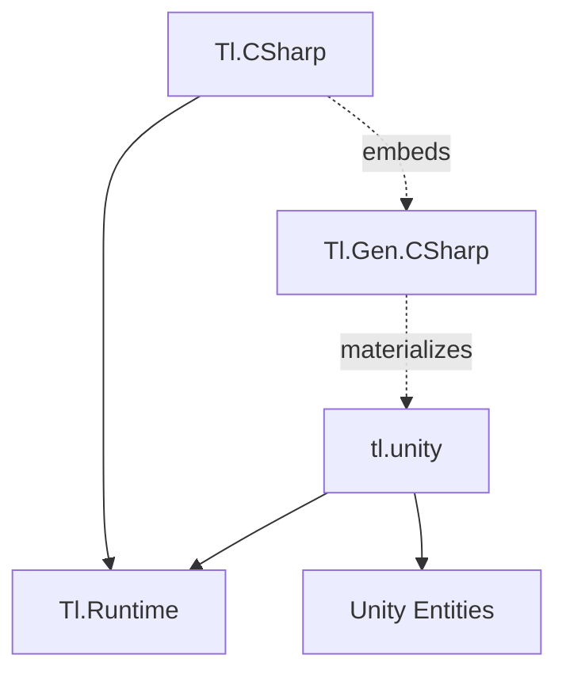
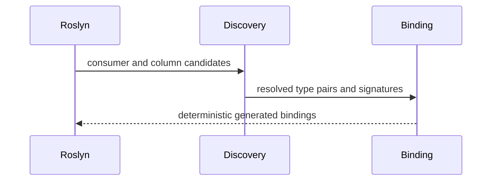

# Architecture

## One asset format, separate hosts

Baked assets carry type identity, timing, clip windows, and authored order. `Tl.Core` validates imported bytes, owns selection and ordered stage execution, and exposes read-only typed frame queries. Its public records contain no Roslyn symbol, C# type spelling, callback body, or Unity type.

`Tl.Gen.CSharp` owns Roslyn discovery of consumer pairs, C# semantic binding, operation signatures, diagnostics, and C# source emission. The adapter binds each valid `(track, clip)` consumer to the runtime's operation identities. Hosts consume the validated asset and binding rather than rebuilding regions or ordering independently.

The Unity backend consumes the same asset format and binding but materializes source before Unity script compilation. This lets the Entities generator discover physical job declarations in the following compiler pass. Host storage differs: .NET borrows caller-owned arrays; Unity queries ECS chunks and components. Their authored operation semantics and occurrence schedule remain shared.

Designer GUI authoring is a future frontend. It must produce the same baked asset format rather than introduce a second execution model.

## Package direction

`Tl.Runtime` is the only .NET application dependency. It contains declarations, borrowed frames, flags, state, and total movement. The Unity application package lives in the extracted [IAFahim/tl.unity](https://github.com/IAFahim/tl.unity) repository under the MIT license decided in [issue #64](https://github.com/IAFahim/tl/issues/64); it depends on the runtime sources plus Entities. Neither application boundary contains Roslyn, a registry, reflection binding, delegate dispatch, a runtime authoring graph, or generated asset data.

`Tl.Gen.CSharp` targets netstandard2.0 for Roslyn analyzer hosts and net10.0 for explicit export. The tool directory contains its own Roslyn assemblies. `Tl.CSharp` embeds those build assets and depends only on `Tl.Runtime`; build assets never become application references. Unity materialization runs in a separate .NET authoring process and writes physical C# for the Unity compiler, Entities generator, and Burst pipeline.

The C backend was extracted into a separate repository at commit `3e67333`. Its existing C ABI v2 remains separate from the data-authored asset format. C asset consumption requires its own reviewed migration.

## Compilation

The incremental generator discovers `ITimelineJob<TTrack,TClip>` consumer declarations already present in the compilation. It resolves the declared track and clip types and borrowed component slots, validates the complete consumer graph, then emits deterministic typed consumer bindings.

Normal and supporting IDE design-time builds run this pipeline automatically. Another generator's ordinary `RegisterSourceOutput` cannot feed these declarations into the same compilation. The explicit `TlGenExport` target runs the same discovery and emitter when physical source, a deterministic manifest, and a generation report are required.

The export cache hashes source contents, references, compiler options, and generator identity. A hit preserves files and timestamps. A miss atomically replaces owned content and removes stale owned outputs. No benchmark autotuning occurs during generation.

## Generated data

The generator emits consumer bindings, not timeline definitions: one `TlConsumerBinding.g.cs` per compilation installs every discovered `ITimelineJob<TTrack,TClip>` pair into the process-global `PairTable` through a module initializer, using the pair key and the column set derived from each `Execute` signature. Timeline content — duration, loop mode, tracks, clips, stages — lives entirely in the baked TLB1 asset, never in source. Sizes are reported separately:

- baked asset bytes (header, pair table, stage table, step programs, frame slots)
- generated binding C# UTF-8 bytes
- native bind-table bytes per (pair, asset): `28 * (duration + 1)`
- per-row caller state: position (`ushort`), effect columns
- managed and NativeAOT output bytes
- warm managed allocation (0 B by receipt)

## Execution

Warm .NET playback is the typed lane: `Timeline<T>.Seek(positions, forward).Apply(effects)` scans caller-borrowed columns for run-length groups, resolves each group's effect and next position once through `T`'s static abstract members, and applies with vector adds and fills. `T` is either a hand-authored `ITimelineLane<T>` or `BakedLane<TTrack,TClip>`, whose cold `Bind` measures per-position forward/backward float effects by running the interpreted cold executor over the loaded asset once per position, with `TickPurity.WindowConstant` consumers instead filling blend-constant windows from one evaluation per stage. The hot body has no interface dispatch on the row path, no runtime lookup, reflection, boxing, or allocation.

One row may execute animation→damage→animation while another executes damage→animation; authored occurrence order and its exact reverse are captured in the measured tables. Cold execution and inspection use the interpreted `TimelineRef.Select/Execute` walk and the read-only typed frame queries. The supported parallel domain is row-local mutable components plus immutable shared data.

## State and lifetime

Row state is caller-owned: a dense `ushort` position column and float effect columns, borrowed only for a lane call. Game time belongs to the host; the lane advances exactly one frame per call. Finite movement clamps; looping movement wraps. Selection is pure and invokes no user code on the warm path.

The lane's native effect tables are published per (pair, asset) by pointer swap at `Bind`; a rebind frees the previous tables, so a host rebinding a lane must quiesce its applies first (single-owner discipline, same shape as the asset rule). Generated consumer bindings live for the process and need no publication lock or reclamation protocol. [Ownership and staleness proofs](memory-and-performance.md) live with the memory rules.

Unity owns ECS component and dependency lifetime. Generated Unity selection, typed operation, and commit jobs must respect host fences before replacing definition data. No per-frame lock belongs in the common path.

## Extension boundary

An extension may add a frontend, backend, importer, editor, operation library, analyzer, visualizer, profiler, or scheduler. It earns compatibility by consuming the public versioned plan or runtime ABI and passing conformance receipts. It does not patch generated text, reach into private Roslyn models, mutate a validated plan, or insert effects outside the ordered occurrence graph.
