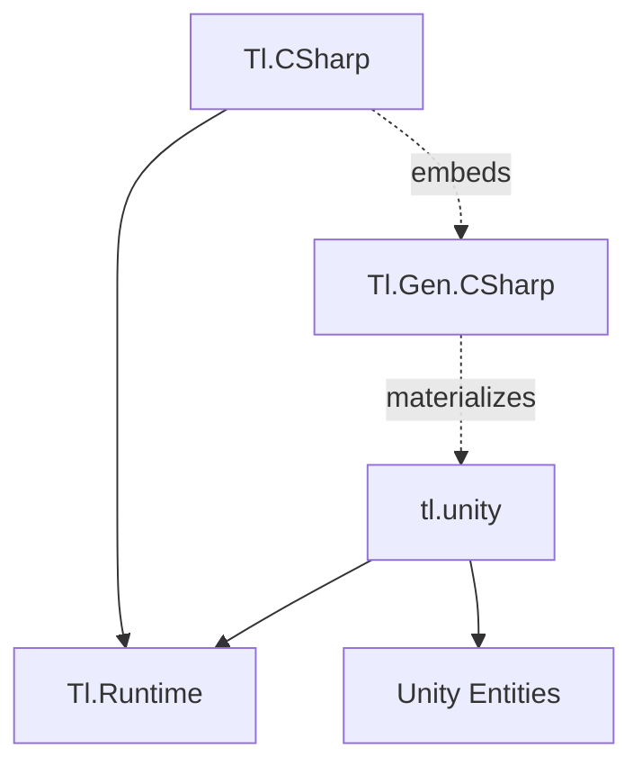
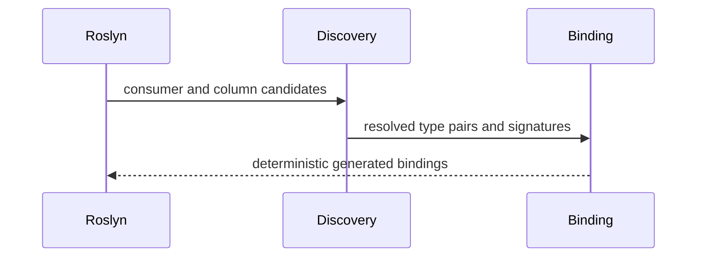

# Architecture

## One asset format, separate hosts

Baked assets carry type identity, timing, clip windows, and authored order. `Tl.Core` validates imported bytes, owns selection, ordered stage execution, and delayed commit, and exposes read-only typed frame queries. Its public records contain no Roslyn symbol, C# type spelling, callback body, or Unity type.

`Tl.Gen.CSharp` owns Roslyn discovery of consumer pairs, C# semantic binding, operation signatures, diagnostics, and C# source emission. The adapter binds each valid `(track, clip)` consumer to the runtime's operation identities. Hosts consume the validated asset and binding rather than rebuilding regions or ordering independently.

The Unity backend consumes the same asset format and binding but materializes source before Unity script compilation. This lets the Entities generator discover physical job declarations in the following compiler pass. Host storage differs: .NET borrows caller-owned arrays; Unity queries ECS chunks and components. Their authored operation semantics and occurrence schedule remain shared.

Designer GUI authoring is a future frontend. It must produce the same baked asset format rather than introduce a second execution model.

## Package direction

`Tl.Runtime` is the only .NET application dependency. It contains declarations, borrowed frames, flags, state, and total movement. The Unity application package lives in the extracted tl.unity repository pending [issue #64](https://github.com/IAFahim/tl/issues/64); it depends on the runtime sources plus Entities. Neither application boundary contains Roslyn, a registry, reflection binding, delegate dispatch, a runtime authoring graph, or generated asset data.

`Tl.Gen.CSharp` targets netstandard2.0 for Roslyn analyzer hosts and net10.0 for explicit export. The tool directory contains its own Roslyn assemblies. `Tl.CSharp` embeds those build assets and depends only on `Tl.Runtime`; build assets never become application references. Unity materialization runs in a separate .NET authoring process and writes physical C# for the Unity compiler, Entities generator, and Burst pipeline.

The C backend was extracted into a separate repository at commit `3e67333`. Its existing C ABI v2 remains separate from the data-authored asset format. C asset consumption requires its own reviewed migration.

## Compilation

The incremental generator discovers `ITimelineJob<TTrack,TClip>` consumer declarations already present in the compilation. It resolves the declared track and clip types and borrowed component slots, validates the complete consumer graph, then emits deterministic typed consumer bindings.

Normal and supporting IDE design-time builds run this pipeline automatically. Another generator's ordinary `RegisterSourceOutput` cannot feed these declarations into the same compilation. The explicit `TlGenExport` target runs the same discovery and emitter when physical source, a deterministic manifest, and a generation report are required.

The export cache hashes source contents, references, compiler options, and generator identity. A hit preserves files and timestamps. A miss atomically replaces owned content and removes stale owned outputs. No benchmark autotuning occurs during generation.

## Generated data

Each timeline contains compile-time duration, loop mode, track count, clip count, maximum stage count, and exact static track/clip payloads. Structurally equal payload expressions share one static storage slot. Region branches encode the active occurrence slice and blend facts.

Each catalog contains deterministic local asset routes and schema query types. Per row, generated state holds committed asset/position/cycle plus bounded pending selection. Query instances borrow state and component columns and retain no heap object or frame queue.

Static data and state are reported separately:

- neutral payload bytes
- neutral schedule bytes
- generated C# UTF-8 bytes
- generated static data bytes
- catalog state bytes per row
- managed and NativeAOT output bytes
- native text bytes
- warm managed allocation

The neutral plan deduplicates exact type identity plus canonical payload bytes. The C# binding currently deduplicates identical normalized type and expression bindings. A hash match alone never establishes equality.

## Execution

For each requested simulation step, a generated .NET query validates routes, selects every row once, runs typed operation passes in stage order, then commits each selected row once. One row may execute animation→damage→animation while another executes damage→animation. Reverse movement traverses each row's occurrence slice backward.

The generated operation entry selects a region, checks the current stage, resolves at most one blend, constructs a borrowed frame, and calls the concrete static job directly. The hot body has no interface dispatch, function pointer, runtime lookup, reflection, boxing, or allocation.

The generated schema query keeps operation types separate across rows. This is the seam for vectorization and Unity job scheduling, but arbitrary C# operations are not assumed pure, lane-independent, or vectorizable. The supported parallel domain is row-local mutable components plus immutable shared data.

## State and lifetime

Catalog state is caller-owned. Default state selects empty route zero. A nonempty state carries a generated catalog asset, unsigned local position, and signed loop cycle. Game time is supplied to each `Tick` call.

Finite movement clamps at zero and duration. Nonempty looping movement wraps position and changes cycle with explicit two's-complement overflow. Selection is pure and invokes no user code. Commit occurs only after all selected stages complete.

Query and frame values borrow caller storage through spans and ref structs. They cannot escape to the heap or cross asynchronous suspension. Generated static definitions live for the process and need no publication lock or reclamation protocol.

The shared bind cache for data-authored rows is one immutable native record per (asset, column shape), keyed on the asset block address, the ordered column key sequence, and the consumer/kernel registration phase. Records are published once through a single compare-exchange claim, read lock-free on every tick path, and invalidated by `TimelineAsset.Dispose`; the cache holds no managed state, allocates nothing warm, and never blocks. [Ownership and staleness proofs](memory-and-performance.md#shared-bind-cache) live with the memory rules.

Unity owns ECS component and dependency lifetime. Generated Unity selection, typed operation, and commit jobs must respect host fences before replacing definition data. No per-frame lock belongs in the common path.

## Extension boundary

An extension may add a frontend, backend, importer, editor, operation library, analyzer, visualizer, profiler, or scheduler. It earns compatibility by consuming the public versioned plan or runtime ABI and passing conformance receipts. It does not patch generated text, reach into private Roslyn models, mutate a validated plan, or insert effects outside the ordered occurrence graph.
