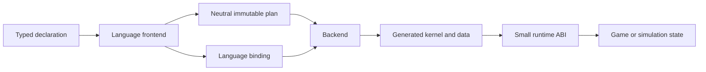
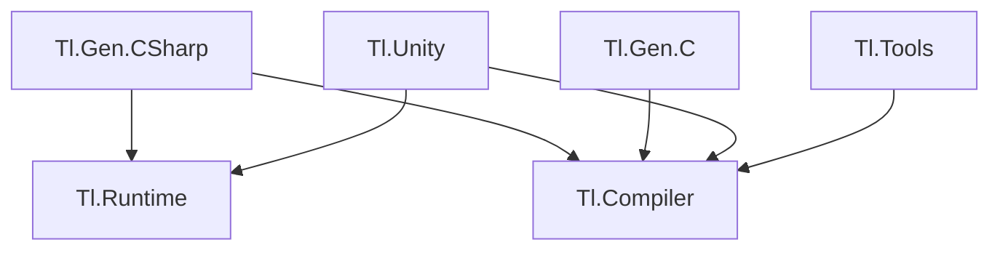

# Architecture

## System shape

`tl` has four boundaries: declaration, plan, backend, and playback.

The current plan contains identity, fixed-width track and clip records, half-open windows, operation IDs, and lifecycle traits. Backends derive regions and movement facts deterministically. It contains no syntax tree, C# type spelling, constructor expression, callback body, or runtime object. A language binding maps payload IDs and operation IDs to constructs available in that language.

This separation allows a C# frontend to feed C#, C11, Unity/Burst, C++, Rust, visualization, validation, and asset tooling without forcing those consumers to understand Roslyn. Arbitrary C# behavior is never translated implicitly. A backend invokes the operation implementation supplied by its own language binding.

## Package direction

`Tl.Runtime` remains the only required game-output dependency for the current .NET path. Compiler and backend packages run during development or build. Future editor, asset, visualization, networking, and domain packages depend inward on the plan or runtime contract; the core never depends on them.

Backend repositories may split out after the plan format and compatibility suite reach a stable version. Until then, the monorepo keeps atomic changes testable. A split backend must consume a released `Tl.Compiler` package and pass the same conformance fixtures; it may not copy private compiler models.

## C# compilation

The C# package runs before compilation for normal and IDE design-time builds. It reads normal compile items with Roslyn, validates declarations, lowers them deterministically, writes content-stable generated files, and records a manifest and report under `obj/<configuration>/<tfm>/TlGenCompile`.

The generated timeline owns static payload values, direct forward/backward region blocks, generated borrowed `Input` and `Output` contexts, and one module/ordinal route. Exact-schema public calls inline through the generated context protocol. Registry lookup, reflection, binding, callback interfaces, and a generic interpreter do not appear in the exact hot body.

## Runtime ownership

`Playback` is a 12-byte caller-owned value containing absolute tick, cycle count, owner ID, and lifecycle flags. Generated contexts are stack-only borrowed views over caller storage. `Frame<TTrack,TClip>` is scoped to the operation call. The runtime retains none of these values.

The ID registry is a sparse two-level unmanaged table. Registration allocates and publishes complete immutable entries under a small construction gate. Playback performs read-only access after publication. IDs are never reused and compiled definitions live for the process lifetime, so stale handles cannot alias a new definition and playback needs no reclamation protocol.

## C11 boundary

`Tl.Gen.C` emits a versioned C11 header and source pair from a neutral plan plus explicit symbol bindings. The header fixes integer widths, lifecycle flags, clip states, `tl_playback`, `tl_frame`, layout assertions, and total `try` operations. Consumer-owned `void*` context crosses only the C boundary; each bound operation interprets it.

The first C backend is an in-process ABI. It does not define an on-disk format or network byte order. A serialized plan will require a separate canonical format with explicit endianness and compatibility rules.

## Extension invariants

An extension may add a frontend, backend, operation library, analyzer, editor, importer, exporter, profiler, or scheduler. It earns compatibility by consuming public versioned contracts and passing conformance receipts. It never patches generated text, reaches into private Roslyn models, mutates a published plan, or inserts work into playback without appearing in the authored operation graph.
