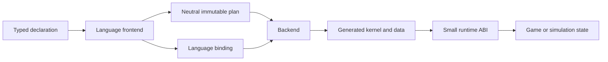
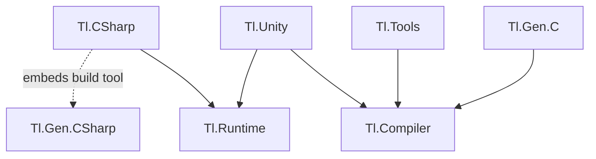

# Architecture

## System shape

`tl` has four boundaries: declaration, plan, backend, and playback.

The current plan contains identity, fixed-width track and clip records, half-open windows, operation IDs, and lifecycle traits. `TimelinePlan.Validate()` returns the public format-v1 validated view after checking identity, track capacity and identity, operation presence, clip ownership and windows, and the two-clip overlap bound in authored order. The same step lowers deterministic half-open regions whose work preserves authored track order and uses clip start followed by authored clip ordinal for ties. It contains no syntax tree, C# type spelling, constructor expression, callback body, or runtime object. A language binding maps payload IDs and operation IDs to constructs available in that language.

This separation allows a C# frontend to feed C#, C11, Unity/Burst, C++, Rust, visualization, validation, and asset tooling without forcing those consumers to understand Roslyn. Arbitrary C# behavior is never translated implicitly. A backend invokes the operation implementation supplied by its own language binding.

## Package direction

`Tl.CSharp` has one package dependency on `Tl.Runtime` and embeds the `Tl.Gen.CSharp` tool payload for builds. `Tl.Gen.CSharp` currently depends on Roslyn and retains its private C# model because its expressions, hooks, schemas, modules, and routes are outside the current neutral format; it does not yet reference `Tl.Compiler` or `Tl.Runtime`. `Tl.Gen.C` references only `Tl.Compiler` and consumes the validated region schedule. `Tl.Runtime` remains the only required game-output dependency for the current .NET path. Future editor, asset, visualization, networking, and domain packages depend inward on the plan or runtime contract; the core never depends on them.

Backend repositories may split out after the plan format and compatibility suite reach a stable version. Until then, the monorepo keeps atomic changes testable. A split backend must consume a released `Tl.Compiler` package and pass the same conformance fixtures; it may not copy private compiler models.

## C# compilation

The C# package runs before compilation for normal and IDE design-time builds. It reads normal compile items with Roslyn, validates declarations, lowers them deterministically, writes content-stable generated files, and records a manifest and report under `obj/<configuration>/<tfm>/TlGenCompile`.

The generated timeline owns static payload values, direct signed-seek region blocks, one generated borrowed `Data` context, a dynamic-context adapter, and one module/ordinal route. Exact-schema public calls inline through the generated context protocol. Registry lookup, reflection, binding, callback interfaces, and a generic interpreter do not appear in the typed hot body.

## Runtime ownership

`Playback` and `Playback<TTimeline>` are 16-byte caller-owned readonly sequential values containing signed position, game tick, lifecycle flags, and dynamic owner where required. Generated contexts are stack-only borrowed views over caller storage. `Frame<TTrack,TClip>` is a readonly ref struct scoped to the operation call. The runtime retains none of these values.

`Start(gameTick)` anchors timeline position zero to simulation time. Signed seek replays every crossed local frame. Positive execution applies authored effects in order; negative execution applies the structurally reversed schedule. Finite validation completes before effects, and zero delta performs validation without callbacks.

The ID registry is a sparse two-level unmanaged table. Registration allocates and publishes complete immutable entries under a small construction gate. Playback performs read-only access after publication. IDs are never reused and compiled definitions live for the process lifetime, so stale handles cannot alias a new definition and playback needs no reclamation protocol.

## C11 boundary

`Tl.Gen.C` emits an ABI v2 C11 header and source pair from a format-v1 validated neutral plan plus explicit symbol bindings. The frontend embeds a plan-format value at its call site, validation preserves it, and the C backend rejects a value other than its independently compiled supported version before emission. Plan-format and C-ABI versions advance independently. Its caller-owned `tl_playback` is 16 bytes with 8-byte alignment, and its callback-scoped `tl_frame` is 40 bytes with 8-byte alignment. A supported target has 8-bit bytes, the asserted fixed-width integer layouts, 8-byte aggregate alignment, and IEEE binary32 storage characteristics.

`try_seek` accepts a signed delta and replays every crossed frame in forward order or its structural reverse. It snapshots playback and validates identity, ownership, lifecycle, source and target bounds, overflow, and required context before callbacks. Failure preserves playback and produces no effects; zero delta validates without callbacks. Consumer-owned `void*` context may alias playback and next, and `try_stop` also supports playback/output aliasing.

The C ABI is in-process and uses native byte order plus native floating-point evaluation and rounding, as declared by its generated ABI macros. It does not define an on-disk format or network byte order. `TimelinePlanCodec` separately defines the canonical plan interchange bytes and hash; target ABIs never reinterpret those bytes as native structs. C layout or timing evidence does not establish the managed C# ABI.

## Extension invariants

An extension may add a frontend, backend, operation library, analyzer, editor, importer, exporter, profiler, or scheduler. It earns compatibility by consuming public versioned contracts and passing conformance receipts. It never patches generated text, reaches into private Roslyn models, mutates a published plan, or inserts work into playback without appearing in the authored operation graph.
