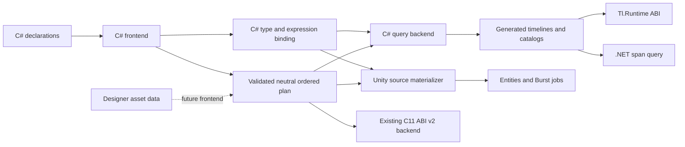
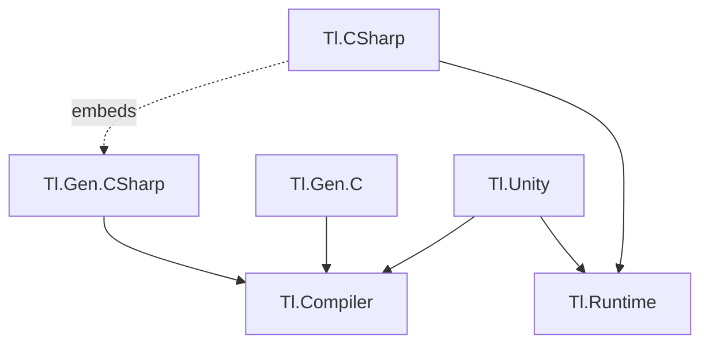
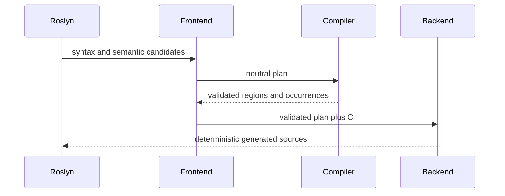

# Architecture

## One semantic plan, separate hosts

`Tl.Compiler` owns language-neutral identity, payload encoding identities, operation slots, tracks, clips, hooks, half-open regions, ordered occurrences, exact payload deduplication, and validation. Its public records contain no Roslyn symbol, C# type spelling, constructor expression, callback body, or Unity type.

`Tl.Gen.CSharp` owns Roslyn discovery, C# semantic binding, constant expressions, operation signatures, diagnostics, and C# source emission. The adapter converts each valid C# declaration into a neutral plan plus index-aligned C# bindings. Backends consume the validated plan rather than rebuilding regions or ordering independently.

The Unity backend consumes the same plan and binding but materializes source before Unity script compilation. This lets the Entities generator discover physical job declarations in the following compiler pass. Host storage differs: .NET borrows spans; Unity queries ECS chunks and components. Their authored operation semantics and occurrence schedule remain shared.

Designer GUI authoring is a future frontend. It must produce the same validated plan rather than introduce a second execution model.

## Package direction

`Tl.Runtime` is the only C# application dependency. It contains declarations, borrowed frames, flags, state, and total movement. It has no Roslyn, compiler, registry, reflection, delegate dispatch, runtime authoring graph, or generated asset data.

`Tl.Gen.CSharp` targets netstandard2.0 for Roslyn analyzer hosts and net10.0 for explicit export. The package places the compatible `Tl.Compiler.dll` beside the analyzer. The tool directory contains its own compiler and Roslyn assemblies. `Tl.CSharp` embeds those same build assets and depends only on `Tl.Runtime`; build assets never become application references.

`Tl.Gen.C` consumes `Tl.Compiler` as a normal package dependency. Its existing C ABI v2 remains separate from the alpha.3 C# catalog API. C catalog generation requires its own reviewed migration.

## Compilation

The incremental generator discovers partial `ITimeline` and `ITimelineCatalog` declarations already present in the compilation. It reads only supported declarative builder syntax, resolves job signatures and schema slots, validates the complete graph, adapts it to the neutral ordered plan, then emits deterministic timeline and catalog sources.

Normal and supporting IDE design-time builds run this pipeline automatically. Another generator's ordinary `RegisterSourceOutput` cannot feed these declarations into the same compilation. The explicit `TlGenExport` target runs the same reader and emitter when physical source, a deterministic manifest, and a generation report are required.

The export cache hashes source contents, references, compiler options, and generator identity. A hit preserves files and timestamps. A miss atomically replaces owned content and removes stale owned outputs. No benchmark autotuning occurs during generation.

## Generated data

Each timeline contains compile-time duration, loop mode, track count, clip count, maximum stage count, and exact static track/clip payloads. Structurally equal payload expressions share one static storage slot. Region branches encode the active occurrence slice and blend facts.

Each catalog contains deterministic local asset routes and schema query types. Per row, generated state holds committed asset/position/cycle plus bounded pending selection. Query instances borrow state and component columns and retain no heap object or frame queue.

Static data and state are reported separately:

- neutral payload bytes
- neutral schedule bytes
- generated C# UTF-8 bytes
- generated static data bytes
- catalog state bytes per row
- managed and NativeAOT output bytes
- native text bytes
- warm managed allocation

Exact deduplication is semantic and bit-sensitive at the language binding. A hash match alone never establishes equality.

## Execution

For each requested simulation step, a generated .NET query validates routes, selects every row once, runs typed operation passes in stage order, then commits each selected row once. One row may execute animation→damage→animation while another executes damage→animation. Reverse movement traverses each row's occurrence slice backward.

The generated operation entry selects a region, checks the current stage, resolves at most one blend, constructs a borrowed frame, and calls the concrete static job directly. The hot body has no interface dispatch, function pointer, runtime lookup, reflection, boxing, or allocation.

The generated schema query keeps operation types separate across rows. This is the seam for vectorization and Unity job scheduling, but arbitrary C# operations are not assumed pure, lane-independent, or vectorizable. The supported parallel domain is row-local mutable components plus immutable shared data.

## State and lifetime

Catalog state is caller-owned. Default state selects empty route zero. A nonempty state carries a generated catalog asset, unsigned local position, and signed loop cycle. Game time is supplied to each `Tick` call.

Finite movement clamps at zero and duration. Nonempty looping movement wraps position and changes cycle with explicit two's-complement overflow. Selection is pure and invokes no user code. Commit occurs only after all selected stages complete.

Query and frame values borrow caller storage through spans and ref structs. They cannot escape to the heap or cross asynchronous suspension. Generated static definitions live for the process and need no publication lock or reclamation protocol.

Unity owns ECS component and dependency lifetime. Generated Unity selection, typed operation, and commit jobs must respect host fences before replacing definition data. No per-frame lock belongs in the common path.

## Extension boundary

An extension may add a frontend, backend, importer, editor, operation library, analyzer, visualizer, profiler, or scheduler. It earns compatibility by consuming the public versioned plan or runtime ABI and passing conformance receipts. It does not patch generated text, reach into private Roslyn models, mutate a validated plan, or insert effects outside the ordered occurrence graph.
