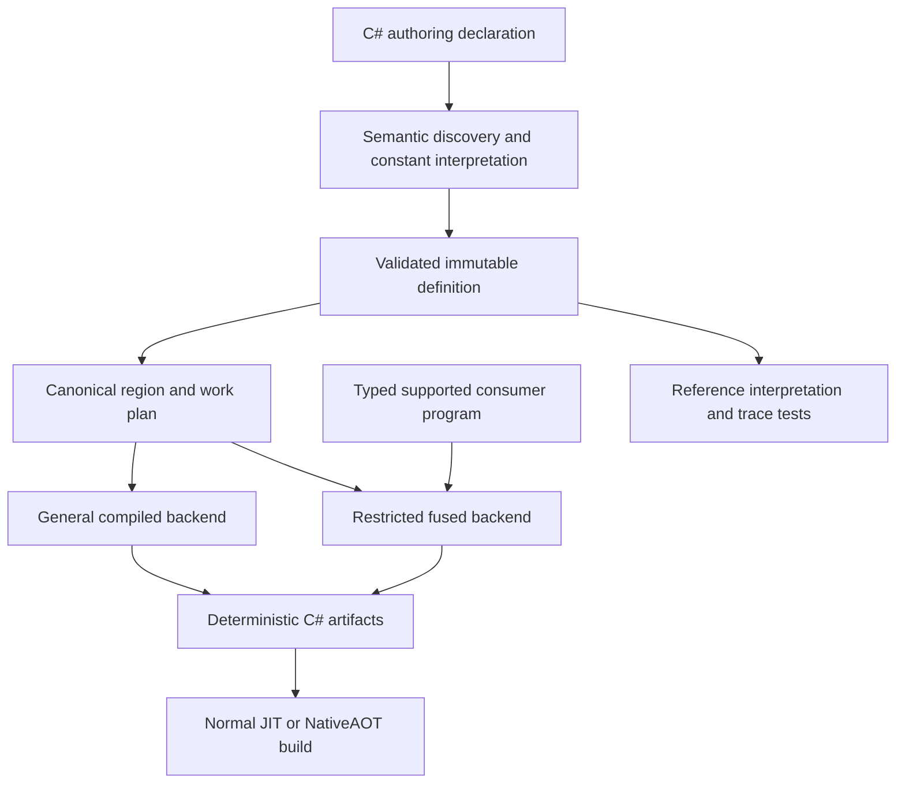

# tl: source generation assessment and implementation plan

Assessment date: 2026-09-09. Repository: `/home/i/GitHub/tl`. Baseline commit: `0ef2676`. The working tree was clean when inspected.

Status: the first reviewed implementation wave is applied locally to /home/i/GitHub/tl, without a commit or public API redesign. The source tree is 186,680 bytes including paths. Sections 15–19 record the constraints, accepted results, remaining work, and CI alert investigation. Historical measurements below are separate from the fresh experiments.

## 1. Decision and performance answer

**A 1–2 ns/tick target is credible for a bounded, fully specialized timeline and consumer. This repository already records that result for Fused16. It is not an established target for the current general `.Compile()` API.**

The strongest next step is to develop tl into a small domain compiler:

`declaration → validated timeline data → execution plan → generated C# → ordinary JIT or NativeAOT compilation`

That compiler should support two execution contracts:

| Contract | What remains dynamic | Performance position |
|---|---|---|
| General compiled playback | Arbitrary supported consumer hooks and `IBlend` implementations | Original production-harness Pulse result: 17.08 ns/tick single; 11.76 ns/tick batch eight, tiered JIT |
| Fused playback | Tick, previous playback, input and explicitly modeled result state; schedule and supported operations are specialized | Existing Fused16 result: 1.236 ns/tick for single calls; 1.088 ns/tick for batches of eight, tiered JIT |

“Single calls” in these benchmarks still means throughput across a warmed loop containing many calls. It does not measure an isolated cold call, startup, OS scheduling, or end-to-end application latency.

For the richer existing frozen Vitals fixture, the recorded tiered results are 2.942 ns/tick single and 2.587 ns/tick batch. Even the frozen backend does not meet 2 ns on every fixture. The Pulse fixture has looping, blends, gaps, and a different consumer contract; transferring the Fused16 number to Pulse would be an unsupported claim.

The intended product outcome is straightforward: author a timeline once and use the same playback and consumer API whether its implementation is generated or interpreted. Compilation strategy stays behind that API. Runtime construction is reserved for data that actually arrives at runtime. No runtime compiler, reflection, registry registration, or managed authoring graph is needed for a directly resolved generated static kernel.

The two backend capabilities above must not become two consumer interfaces. In particular, requiring `ICompiledForward` beside `IForward` is a migration problem to remove, not the desired final API. When the generator can prove the relevant schedule and consumer operations, it specializes them; otherwise the same public operations preserve the general implementation's semantics.

## 2. Evidence and limits of this assessment

### Fresh verification

The tracked repository files were copied into `/tmp/tl-assessment-8lb2bokj` so verification could run without altering the original checkout. The following completed successfully in Release:

| Verification | Result |
|---|---|
| `tests/Tl.Gen.Tests` | 14 tests passed |
| `tests/Tl.Core.Tests` | 44 tests passed |
| `samples/Compiled` | Interpreter/generated parity battery passed |

The sample covered sequential forward and backward walks, the fixture's forward/backward mirror, 4,096 deterministic mixed jumps, batch/single equivalence, gaps, and lifecycle rejection. Its recorded totals were `enters=32`, `stays=2339`, `exits=32`, `ticks=759594`, `sum-bits=465F3D01`.

Verification used `-p:UseSharedCompilation=false` and `-p:NuGetAudit=false`; the test commands also used `-m:1`. These accommodated the execution environment. Dependency vulnerability auditing was not part of the verification result.

Additional CLI probes reproduced discovery, literal parsing, stale output, and determinism problems described below. Their local transcript is `/tmp/tl-assessment-8lb2bokj/assessment-probes/results.json`; this report records the important results so that the temporary directory is not required to resume work.

**At the initial assessment checkpoint, no fresh performance benchmark or NativeAOT publish had been run.** Performance numbers in section 4 are existing repository receipts; the subsequent experimental measurements are recorded separately. Passing the current tests establishes the covered behavior; the additional probes demonstrate that the coverage is incomplete.

### Toolchain

The inspected machine has .NET SDK `10.0.400`, runtime `10.0.11`, and MSBuild `18.9.6`, targeting Linux x64. The repository has no `global.json`. The inspected generator references Roslyn `5.9.0` and Waffle.Core `1.0.0`; the recorded benchmark reports use BenchmarkDotNet `0.15.8`.

.NET 10 is the current LTS release, with support scheduled through November 14, 2028; C# 14 is available with .NET 10. These were checked against the official [.NET support policy](https://dotnet.microsoft.com/en-us/platform/support/policy) and [C# 14 release documentation](https://learn.microsoft.com/en-us/dotnet/csharp/whats-new/csharp-14).

Pin an agreed SDK feature band and C# language version before collecting the next benchmark series. SDK, Roslyn, runtime, architecture, JIT options, and generator version are part of the reproducibility record. Revalidate the release choice during each annual upgrade.

## 3. What already exists

The repository has substantial useful machinery. Preserve its domain semantics and its measurement history.

| Area | Current implementation | Implication |
|---|---|---|
| Runtime authoring | `TimelineBuilder` and `TimelineAuthoring`; `.InMemory()` lowers to native storage | Suitable for runtime-supplied timeline data |
| Playback | Eight-byte caller-owned `Playback`; explicit direction; immutable returned playback | A compact state transition contract worth preserving |
| Consumption | `in TInput`, `ref TResult`, typed track/clip views, indexed access and slices | Supports real consumers without copying entire payload collections |
| Runtime storage | Native timeline block, registry, explicit binding and destruction | Keep lifetime concerns outside the pure compiler model |
| Compile discovery | Roslyn syntax reader called by the Tl.Gen CLI | Build-time generation exists; it is not yet an incremental Roslyn generator |
| Planning | Region analysis and materialized work slots | The beginnings of a compiler intermediate representation already exist |
| Compiled execution | Generated static kernel, compare tree, per-region slot arrays, generated views and hooks | Removes runtime registry dispatch; substantial interpretation remains |
| Frozen experiments | Benchmark generator emits baked values, movement references and direct sink updates | Demonstrates the 1–2 ns path, but is not a general production backend |
| Correctness evidence | Core tests, generator tests, oracle checks, parity sample and AOT receipts | Extend these instead of replacing them with emitter snapshots alone |

Relevant current files:

- [Authoring builder](src/Tl.Core/Authoring/Builder.cs), [runtime lowering](src/Tl.Core/Authoring/Lowering.cs), [runtime transitions](src/Tl.Core/Internal/Playback.cs), [views](src/Tl.Core/Tracks.cs).
- [Declaration reader](src/Tl.Gen/Analysis/DeclarationReader.cs), [region analysis](src/Tl.Gen/Analysis/Regions.cs), [work-slot materialization](src/Tl.Gen/Analysis/WorkSlots.cs), [kernel emitter](src/Tl.Gen/CSharp/KernelEmitter.cs).
- [Build integration](src/Tl.Gen/build/Tl.Gen.targets), [CLI](src/Tl.Gen/GeneratorCli.cs), [compiled sample](samples/Compiled/Timeline.cs), [compiled consumer](samples/Compiled/Consumer.cs).
- [Frozen benchmark generation](benchmarks/Generate/Program.cs), [performance history](docs/benchmarks.md), [current compiled-path report](docs/v0.4-compile.md).

The current compiled hot path is approximately:

```text
validate playback
reserve blend scratch
for each tick:
    compute effective position, cycles and lifecycle flags
    locate region through generated comparisons
    switch on region to select its managed static slot array
    construct a typed view
    call the consumer
    enumerate selected works
    resolve requested blends and states
return playback
```

Some of those steps can disappear after JIT optimization. Disassembly, rather than the C# surface alone, must establish which ones remain for each consumer.

## 4. Performance receipts and their interpretation

### Current `.Compile()` versus interpreter

These are medians from the committed [2026-09-09 BenchmarkDotNet report](benchmarks/Dispatch/results/v04-compile-20260909/Tl.CompiledBench.CompiledVsInterpreter-report-github.md), on an Intel Core i9-14900K with .NET 10.0.11. The same authored Pulse timeline and corresponding consumer run on both legs.

| Method | Tiered JIT, ns/tick | Tiering disabled, ns/tick |
|---|---:|---:|
| Interpreter single | 21.58 | 29.32 |
| Compiled single | 17.08 | 28.74 |
| Interpreter batch 8 | 14.42 | 21.13 |
| Compiled batch 8 | 11.76 | 18.93 |
| Sum consumer, interpreter single | 18.19 | 25.01 |
| Sum consumer, compiled single | 19.24 | 17.80 |

The general compiled path reduces the tiered full-consumer single time by about 20.9%, and batch time by about 18.4%. The light consumer regresses by about 5.8% under tiering. Source generation alone does not guarantee a speedup.

The report's `Ratio` column uses the full interpreter single method as its baseline. It must not be copied as the pairwise speedup for the batch or light-consumer comparisons.

The reports show no measured managed allocation in the warmed benchmark operations. That does not mean the generated kernel has no retained managed arrays or startup allocations.

The existing [compiled-path document](docs/v0.4-compile.md) also records manual NativeAOT measurements of approximately 28.1–28.5 ns/tick interpreter versus 27.3–27.4 compiled. These are Stopwatch measurements, not BenchmarkDotNet results. The document reports session variation up to roughly 20% on the shared machine; the next decision needs controlled reruns.

### Existing frozen results

The [bake-v3 record](docs/benchmarks.md#bake-v3-branchless-under-the-per-work-contract) reports:

| Method | Tiered JIT, ns/tick | Tiering disabled, ns/tick |
|---|---:|---:|
| Fused16 single | 1.236 | 1.107 |
| Fused16 batch 8 | 1.088 | 1.061 |
| Fused16 sequential | 1.190 | 1.105 |
| Frozen Vitals single | 2.942 | 2.722 |
| Frozen Vitals batch 8 | 2.587 | 2.478 |

Fused16 is a fixed sink and a bounded non-looping schedule with 16 clips and a 63-tick duration. The generated kernel can read primitive frozen data and update that sink directly. It does not pay the general `CompiledTracks` consumer handoff. A separate manual AOT receipt records about 1.094 ns/tick for Fused16 batch 8.

The frozen results justify productizing specialization. They do not establish a universal hardware lower bound, or prove that arbitrary user callbacks can complete within two nanoseconds.

A fresh boundary probe against the existing generated Fused16 code confirmed three differences from the production contract: `Start(uint.MaxValue)` followed by the gap tick 3 changes `sink.Flags` to 1 although no work is active; starting `sink.Sum` at negative zero and visiting that gap changes its bits to positive zero; and default/unstarted playback is accepted. The probe is preserved locally at `/tmp/tl-frozen-contract-probe`. The historical timings are valid for their tested fixture domain, but full lifecycle and bit-exact arbitrary-input behavior must be included when qualifying a production frozen backend.

### Experiments already answered

Carry these decisions forward unless a materially different hypothesis warrants a new experiment:

- Persistent cursors help sequential workloads; keep their use explicit because random access has different costs.
- Reserve scratch for active blends, enforce a stack budget, and support caller-owned storage.
- Prefix counts for entry checks were rejected after measurement. Do not reintroduce their extra loads on principle.
- Storage deduplication is useful for repetition-heavy retained data and can add overhead elsewhere. Keep it an explicit storage choice.
- Skewed decision trees were rejected in the recorded experiments.
- Packing the general compiled work slots into primitive tables was tried and measured worse. Primitive baked tick data and arbitrary work-slot packing are different experiments.
- Previous branchless emission improvements were lost during a semantic redesign and recovered only after timing and disassembly. Parity tests cannot detect that class of performance regression.

## 5. Findings that should shape implementation

### Reproduced problems

| Priority | Reproduction and observed result | Required correction |
|---|---|---|
| P0 | Generate `CompiledPulse`, rename the declaration to `Renamed`, generate again: both kernels remain. Remove all declarations: both kernels and shared runtime remain. | Generated output ownership must follow current inputs; deletion and rename must remove obsolete outputs. |
| P0 | A source containing `Expression<Func<int>> e = () => 1; e.Compile();` causes `TLGEN01`. | Discover tl declarations by identity; unrelated APIs must be ignored. |
| P1 | Replace the sample receiver with `Tl.Timeline<PulseTrack, PulseClip>.Build(...)`: `TLGEN01`, despite documented qualified-name support. | Bind the actual timeline symbol rather than requiring one syntax shape. |
| P1 | Replace the literal `600` with `6_00`: `TLGEN10`. | Read Roslyn constant values and checked conversions, not reparsed token spelling. |
| P1 | Add `b.DedupStorage(System.DateTime.UtcNow.Ticks > 0)`: generation succeeds and discards the argument. | Validate all accepted arguments. Discarding a setting does not authorize discarding arbitrary argument evaluation. |
| P1 | Generate identical source text from different source paths: emitted kernels differ. | Keep absolute paths and diagnostic positions out of semantic generated output; normalize emitted text. |

These were CLI reproductions. Package installation, IDE behavior and full project lifecycle tests remain separate work.

### Source-inspected design gaps

1. **The declaration marker does not suppress runtime authoring.** `Timeline.Build` executes `build(builder)` in [Timeline.cs](src/Tl.Core/Timeline.cs). If the static `.Build(...).Compile()` initializer is accessed, its authoring callback runs before the no-op marker extension. The sample avoids this by never touching the declaration holder. It does not register a native timeline without `.InMemory()`, but it can allocate and run user effects. Correct the conflicting claims in the generated text and documentation.

2. **Literal constructor arguments are not proof of constant data.** `new Payload(1)` can execute a constructor that reads mutable globals, performs I/O, throws, or changes state. The reader copies source expressions into runtime static initializers; it does not freeze arbitrary constructor execution. A `static` lambda only forbids capture. The fused contract needs a supported data and operation grammar, not a purity assumption about arbitrary C#.

3. **Discovery lacks compilation semantics.** Method-group resolution uses syntax names; emitted type and payload names depend on lexical scope. Aliases, overloads, nested namespaces/types, accessibility, conditional compilation and same-named declarations in different namespaces need explicit semantic handling. Kernel uniqueness is currently checked by short kernel name alone.

4. **Content-stable writes are not incremental analysis.** The CLI compile target has no input/output cache declaration and scans selected `TlCompileTimeline` files. It writes changed text but retains obsolete files. A hand-maintained source list also omits new authoring dependencies unless updated.

5. **The model mixes domain data with C# source and mutable containers.** `TimelineDefinition` exposes `List` collections and payload expressions; `TimelinePlan` exposes arrays and a settable strategy. `init` does not freeze the contents of a collection. Runtime lowering and generator analysis duplicate schedule logic, and the emitted views duplicate runtime view semantics.

6. **Generated scratch has no stack budget check.** `KernelEmitter` emits `stackalloc TClip[MaxActiveBlends]`, while runtime playback has a guarded scratch path. The generator need not know the payload byte size at generation time: generated code can check `Unsafe.SizeOf<TClip>()` before allocating. Add a caller-scratch overload and preserve validation-before-callback behavior.

7. **Playback construction relies on representation tricks.** The generated shared runtime bit-casts a packed `ulong` into `Playback` because the constructor is internal. Replace this with an intentional generation support boundary, with layout tests and defined validation. Do not expose an unrestricted arbitrary-flags factory merely to hide the bit-cast elsewhere.

8. **`Clip` reads are lazy but not memoized.** Each access to a blended `Clip` property calls `Blend` again. An optimization that caches, hoists or removes those calls can change observable behavior for a general implementation. The fused grammar must explicitly permit the transformation; general playback must preserve call order and multiplicity.

9. **The production bake emitter is incomplete.** [BakeEmitter](src/Tl.Gen/CSharp/Bake.cs) allocates unused preparation arrays and emits lifecycle helpers without Forward/Backward playback. Its emitted constructor call also targets an internal `Playback` constructor. The successful benchmark bake is a separate implementation. A parser-only test cannot establish that a generated API builds and runs in a consumer assembly.

10. **Legacy table emission loses authored track values.** [TableEmitter](src/Tl.Gen/CSharp/Tables.cs) creates `new <generated-name>()` for each track instead of using `TrackExpression`. Decide whether this backend intentionally defines a separate table-provider track or promises preservation of author data; make the contract and tests agree before combining backends.

11. **Packaged CLI execution needs a real install test.** The explicit `tools/net10.0/any` payload in [Tl.Gen.csproj](src/Tl.Gen/Tl.Gen.csproj) includes Tl.Gen, Tl.Core and Waffle binaries but does not list the Roslyn dependency binaries used by compile mode. This is a packaging risk identified by inspection, not an install failure reproduced in this assessment. Test the actual `.nupkg` in a separate consumer project without project references.

12. **Documentation describes several different generations of the system.** README examples and version claims lag the current `.InMemory()` and native implementation. `docs/api` contains explicitly historical API mockups; those mockups are not an instruction to rewrite the current runtime. Consolidate the current contract and retain benchmark history as history.

### Runtime follow-ups outside the generated hot path

These deserve focused regression work, but should not expand the compiler project into an unbounded runtime rewrite:

- [NativeBinding.GetCold](src/Tl.Core/Internal/Binding.cs) invokes the automatic binder before checking overflow slots. The inline capacity is four. Inspect and test a fifth explicitly bound input/result pair under NativeAOT; an existing overflow binding must be usable without invoking the unsupported automatic binder.
- Binding overflow growth does not free the old allocation. `Find` returns a pointer after releasing its gate. First change the lookup to copy the record while protected; then reclaim replaced storage safely. Adding only a `Free` would introduce a dangling-pointer risk.
- Cursor ownership currently uses the native entry address and previous tick. Allocators can reuse addresses even though timeline indices are never reused. Include lifetime identity and validate any hint against the current region count; test destruction followed by reuse deterministically.
- Review native allocation rollback if registration fails, including index-capacity exhaustion.
- Preserve the explicit synchronization contract around construction, binding and destruction. Review registry pointer/capacity publication before promising concurrent registry growth. Read-only playback after setup and destruction racing playback are different contracts.

These points are source-inspection findings; the runtime test results above do not establish those scenarios.

## 6. Small domain axioms and executable laws

Use the existing [semantics](docs/semantics.md) and independent oracles as the compatibility reference. The compiler should be explainable through these small operations:

| Primitive | Input and output | Invariant |
|---|---|---|
| Validate definition | Authored data → valid definition or diagnostics | Every clip belongs to a track; nonempty windows; capacities and overlap bounds hold |
| Partition schedule | Valid definition → ordered regions and work descriptors | Every effective tick selects exactly one region, including an empty terminal region |
| Position | Direction, loop trait, duration, prior playback, raw tick → movement or failure | Raw and effective ticks stay distinct; zero duration never divides; cycles are checked |
| Resolve state | Work window and movement → Enter, Stay or Exit | Positional Exit wins over Enter |
| Resolve payload | Single payload or explicit blend operation → payload | Blend argument order and arithmetic remain defined |
| Consume | Ordered work facts, input and result → result/effects | General hooks preserve observable order; supported pure operations can be specialized |
| Fold ticks | Initial playback/result and tick sequence → final playback/result | A batch has the semantics of ordered single steps |

Required semantic details:

- Clip windows are half-open: `[start, end)`, with `end > start`; ticks remain `uint` throughout.
- Timeline duration is the greatest end, or zero for an empty timeline. Sparse large durations must not force duration-sized allocation.
- At most two clips overlap on a track. Preserve authored track order and the existing clip ordering, including tied starts.
- Blend factors use the overlap window; a one-tick overlap uses `0.5f`. Entry and exit references for a pair use its outer window.
- Forward Exit is positional at the final active frame; backward Exit is positional at the first active frame. A one-tick clip therefore reports Exit on arrival.
- Only active destination works are delivered. Gaps do not call the consumer. Jumping entirely over a clip does not synthesize every missed event.
- Start is silent. Default playback is invalid. Stop is silent and idempotent. A valid empty tick span preserves playback and performs no callbacks.
- Looping normalizes effective sampling while retaining raw playback ticks. Forward cycle overflow rejects before the affected tick's callback; backward cycle subtraction saturates at zero.
- A failing batch is not a transaction over arbitrary callbacks: earlier successful callback effects remain visible.

Laws to verify:

```text
Emit(same semantic definition, same explicit options) = same bytes
Analyze(valid definition) = deterministic plan
SelectRegion(plan, tick) = independent half-open-window oracle
Batch(state, []) = state, for runnable state
Batch(state, xs ++ ys) = Batch(Batch(state, xs), ys), for successful walks
CompiledTrace(definition, input, walk) = InterpreterTrace(definition, input, walk)
SupportedFusedTrace(definition, program, input, walk) = ReferenceTrace(...)
Stop(Stop(playback)) = Stop(playback), for started playback
```

Do not assert stronger laws than the API provides. Backward is not automatically an inverse of arbitrary user effects. Floating-point addition is not associative. Repeating a tick can repeat consumer effects. `in` does not make objects reachable through input references deeply immutable. C# closed record hierarchies do not automatically provide exhaustive union checking in every switch.

Use explicit success/error results in compiler validation and pure transition logic where they clarify the domain. Keep compatible exception behavior at public boundaries. A private construction path for a valid plan is stronger than a public struct whose `default` bypasses all validation. Avoid introducing a universal functional framework when a few domain result types suffice.

## 7. Target compiler architecture



### Domain representation

Separate source identity, validated schedule, payload representation, execution strategy and diagnostics. The common planner needs numeric track/clip identities and windows; it should not depend on Roslyn syntax, file paths, native pointers, Waffle rendering, or runtime registry state.

Use immutable value rows and structurally equatable sequences. A record containing an array or `ImmutableArray<T>` is not automatically a structural sequence value for incremental caching. Supply an element comparer or a narrowly scoped equatable sequence wrapper. Builders may mutate local scratch during analysis and publish one immutable result.

Keep arbitrary user C# payload expressions in the general backend's source-bound representation. The fused backend receives a closed, typed constant representation and a supported operation representation. This preserves a useful general path while making the stronger fused guarantees explicit.

Factor shared region planning out of runtime and generation without forcing the compiler host to load the net10 runtime assembly. A small compatible planning assembly or deliberately shared pure source can work; choose the smallest packaging arrangement that actually serves both hosts. Cross-check the shared planner against an independently implemented oracle so shared bugs do not make two wrong implementations agree.

### Actual incremental generation

Introduce a thin `IIncrementalGenerator` host with semantic discovery, per-definition equatable models, cancellation, tracked steps and source-local diagnostics. Keep the CLI as an adapter if `.def` inputs or standalone generation still serve users. Do not keep two independently evolving planners or emitters.

Use a compiler-host-compatible generator target and dependency package layout. Adding `[Generator]` to the current net10 executable is not sufficient. Test against the supported SDK and IDE compiler hosts. Microsoft's [incremental generator cookbook](https://github.com/dotnet/roslyn/blob/main/docs/features/incremental-generators.cookbook.md) documents the equality, pipeline and attribute-discovery practices relevant here.

Generate one stable artifact identity per fully qualified declaration. Keep diagnostics and their locations separate from semantic emission models. Use a fixed newline convention, invariant numeric formatting, ordinal ordering, deterministic identifiers, and no absolute source paths, timestamps or random names in emitted content. Persist only value data after semantic analysis; avoid retaining compiler symbols or syntax trees in long-lived emission models.

For remaining CLI outputs, stage and validate the complete artifact set, then synchronize only files owned by that invocation. Retain timestamps for identical files and prune obsolete owned files. Never delete arbitrary `.g.cs` files based on a broad glob. Include source membership, options and tool version in cache identity, including the transition to zero declarations.

### Declaration API and runtime execution

An ordinary source generator adds source; it cannot erase the original `.Build(...).Compile()` initializer. That limitation is part of the [Roslyn source generator design](https://github.com/dotnet/roslyn/blob/main/docs/features/source-generators.md). Do not promise that a syntax marker becomes a runtime no-op if its receiver already performed work.

The required surface is the existing domain API with backend selection hidden. First share the existing consumer hooks and views. Then add a generation boundary that can represent an already compiled definition without running its authoring callback. A partial declaration or attribute can help identify authoring, but must not force every consumer to use a second API.

For exact fluent syntax and ordinary `Timeline.Forward` calls, evaluate compiler interceptors at semantically recognized call sites. Intercepting only the final `.Compile()` call does not prevent its receiver from being evaluated: authoring suppression must happen at the `Build` call or through a deliberately deferred authoring representation. Preserve all observable evaluation that is not part of the validated pure declaration grammar.

Current Roslyn documents stable interceptor support in SDK 9.0.2xx and later, versioned locations obtained through `GetInterceptableLocation`, and a namespace allowlist through `InterceptorsNamespaces`. Signature and ref-safety compatibility must be checked; not every kind of C# expression is interceptable. Use compiler-provided locations, never hand-built line/column interception. See the official [interceptor design](https://github.com/dotnet/roslyn/blob/main/docs/features/interceptors.md). Validate the installed SDK/IDE behavior in an integration test before adopting this backend.

Use direct generated calls when timeline identity and consumer closure are known at the call site. For a genuinely runtime-selected timeline handle, retain a typed dispatch entry that chooses the prepared implementation. Measure that indirect dispatch separately. Hiding backend selection from the API does not make an unknown runtime target a compile-time constant.

Move shared generated consumer contracts to a deliberate runtime/generation support assembly if needed for cross-project consumers. Emitting the same public `Tl.Compiled` types separately into multiple assemblies creates different CLR type identities. Consolidate with the existing hook/view API where it preserves behavior and measured code quality; avoid adding another permanent duplicate hierarchy.

## 8. Route toward 1–2 ns

### Experiment A: establish the minimum equivalent computation

For each target fixture, write a small reference kernel implementing exactly its required observable operations. Compare it with the interpreter, current generated kernel, and candidate. Consume result data and playback so the benchmark cannot succeed by eliminating useful work.

Measure both sequential and deterministic random input, both directions, loops and non-loops, and single calls versus batches. This tells us whether remaining time belongs to generation overhead, schedule lookup, arithmetic dependencies, or consumer work. A no-op consumer provides a dispatch measurement; it is not a replacement for the real consumer.

### Experiment B: improve the general kernel

In separate measured changes:

1. Test direct region selection of work spans against the current compare-tree-to-integer-to-switch sequence. Inspect whether the JIT already merges these decisions before adding duplicated region bodies.
2. Test direction-specialized emitted bodies or a small static strategy against the runtime direction branch. Code size and inlining can reverse the benefit; do not retain the change based on source appearance.
3. Remove schedule-proven work: zero-blend scratch, irrelevant loop paths, repeated identical region bodies. Keep arbitrary consumer effects intact.
4. Reduce view construction and handoff costs only where the compiled machine code shows they survive optimization. Preserve indexing, slicing, enumeration, and repeated payload-read behavior.
5. Measure shared region storage versus one array per region for retained bytes, startup and hot access. Reuse the previous failed packed-slot result as a control rather than assuming packing wins.

The general backend's acceptance target is a reproducible improvement on the same real consumer, with correctness and allocation guarantees intact. **There is no evidence-backed promise that this backend will reach 2 ns.**

### Experiment C: productize the fused backend

Start with the existing Fused16 contract and reproduce its historical result through the production generator. Then add capabilities one at a time:

| Stage | Supported specialization | Validation requirement |
|---|---|---|
| C1 | Bounded non-looping schedule, scalar constant payloads, fixed ordered accumulation and state/count operations | Reproduce Fused16 trace and throughput with generated production code |
| C2 | Multiple active tracks and gaps | Preserve operation order; measure the Vitals-shaped dependency chain |
| C3 | Explicit supported pure blend operations | Preserve numeric operation sequence and validate JIT/AOT bit patterns |
| C4 | Looping and wide raw ticks | Preserve normalization, wrap facts, completion and cycle failure timing |
| C5 | Small typed input expressions and result updates | Define evaluation order, overflow, aliasing and unsupported operations explicitly |

The fused operation grammar should begin with the operations actual consumers require: typed constants, input reads, supported arithmetic, state selection, and ordered result updates. Separate pure value expressions from effectful result updates. Named external effects, allocation, reflection, arbitrary loops and unknown method calls are not silently interpreted or deleted; report ineligibility and retain an explicit general alternative.

Specialization options include bounded per-tick primitive blobs, constant payload loads, precomputed supported blend values, integer state calculations, and direct result updates. Prefer safe compiler-generated spans over manual unchecked pointers unless assembly and measurement demonstrate a real remaining cost.

Set explicit maximum data bytes and code bytes. Duration alone is insufficient: include slot count, both directions, payload width and sentinels. Sparse timelines near `uint.MaxValue` must use region storage, not a dense lookup table. Backend selection must use explicit options and deterministic plan facts; do not run timing experiments on the developer's machine during compilation.

### Semantic limits on aggressive optimization

- Do not reassociate floating-point sums, replace division with an approximate reciprocal, introduce FMA, or vectorize a serial accumulation without an explicitly different numeric contract.
- `+0` is not a universally unobservable substitute for skipping an effect: signed zero, NaNs, exception behavior and callback counts matter. Prove neutral operations for the supported domain or retain activity selection.
- Test inactive sentinel behavior at `uint.MaxValue`; a comparison using `uint.MaxValue` as an artificial entry edge is not always true for every legal previous tick.
- Do not precompute arbitrary user constructors or `Blend` methods by executing application code in the build host. Define and interpret the supported pure grammar.
- A cached blend changes the number of `Blend` invocations. It requires the pure contract; it is not automatically valid for general hooks.
- Static dispatch, static abstract strategies, SIMD, intrinsics, `Unsafe`, custom IL and NativeAOT are tools, not performance guarantees. Use them only when a specific measured problem justifies them.

### Performance acceptance contract

For the first supported fused fixture, target **at most 2.0 ns/tick** for both the single-call loop and batch-8 throughput on the recorded reference machine, with zero measured managed allocation after warmup. Report random and sequential cases separately. Record NativeAOT independently; do not substitute the JIT result for it.

For Pulse, publish the measured result even if it exceeds 2 ns. A 1–2 ns Pulse target remains a stretch experiment until the minimum equivalent computation and supported fused consumer demonstrate that budget.

Use at least three controlled benchmark sessions for decisions near the target. Compare corresponding cases with the same SDK/runtime, core type, workload, PGO settings and input arrays. A candidate should show a meaningful repeatable improvement; investigate regressions beyond roughly 5% on protected cases instead of hiding them in an average. These thresholds are engineering gates, not a statistical proof.

## 9. Implementation sequence and definitions of done

The main edit boundaries are `Analysis/DeclarationReader.cs` and host integration for M1; `Model`, `Analysis/Regions.cs`, `Analysis/WorkSlots.cs` and `Authoring/Lowering.cs` for M2; and `CSharp/KernelEmitter.cs` plus the incomplete `CSharp/Bake.cs` path for M3/M4. Extend `tests/Tl.Gen.Tests` with semantic compilation, build-lifecycle and incremental-driver tests; keep runtime contract regressions in `tests/Tl.Core.Tests`. Exercise distribution through a separate test consumer and preserve `samples/Compiled` as the readable end-to-end example.

### M0 — preserve the baseline and make the contract current

- [ ] Pin the SDK/language policy and archive environment details.
- [x] Turn the successful temporary CLI probes into durable regression fixtures.
- [x] Separate general, frozen and manual-AOT benchmark claims in this assessment and experimental reports.
- [ ] Correct the `.Compile()` initializer explanation and current README authoring examples.
- [ ] Compile generated output in tests; retain parser tests only as a lower-level check.

Definition of done: the starting behavior and failures are reproducible, every performance comparison identifies its consumer contract, and the documentation does not promise erased runtime authoring.

### M1 — make generation reliable through project changes

- [ ] Implement semantic discovery with explicit declaration identity and supported constants.
- [ ] Fix unrelated Compile calls, aliases/qualified receivers, numeric literals, overload resolution and argument validation.
- [ ] Use fully qualified emission identities and stable source names; test same short names in different namespaces.
- [ ] Introduce incremental host integration and equatable models; keep any CLI adapter on the same pipeline.
- [x] Handle exact no-op builds, relevant edits, declaration rename/removal, file addition/removal, and zero remaining declarations in the CLI artifact protocol.
- [ ] Validate package execution and IDE/design-time behavior without manual source lists.

Definition of done: clean and incremental builds produce the same current artifact set; irrelevant changes do not change kernel content; no deleted timeline survives the build; an unrelated `.Compile()` call never produces a tl diagnostic.

### M2 — establish one validated schedule model and supported ABI

- [ ] Separate source data, valid definition, canonical plan, emission options and diagnostics.
- [ ] Share schedule planning between runtime and generation while retaining an independent oracle.
- [ ] Check every narrowing conversion, row count, offset, scratch count and allocation-size calculation before publication.
- [ ] Replace the unchecked generated stack reservation with a budgeted path and caller-owned scratch overload.
- [ ] Define supported playback construction and shared generated consumer type identity.
- [ ] Remove or finish the incomplete bake path; do not advertise an API that cannot compile and play.

Definition of done: every emitted plan satisfies documented invariants, invalid definitions produce deterministic diagnostics, and generated/runtime traces agree over the semantic battery.

### M3 — ship the first production fused kernel

- [ ] Define the smallest typed operation/data grammar needed for Fused16.
- [ ] Route it through the shared planner and the actual generator package.
- [ ] Emit bounded primitive data and direct ordered result operations without runtime authoring or registry setup.
- [ ] Exercise gaps, endpoints, repeated ticks, reverse walks, maximum raw ticks and supported initial result states.
- [ ] Verify exact receipts on JIT and NativeAOT, then measure single-call and batch throughput.

Definition of done: a separate consumer project authors the supported fixture, builds it normally, and reproduces the 1–2 ns target under the declared benchmark contract. A benchmark-only generator does not satisfy this milestone.

### M4 — improve general playback and extend fusion under measurement

- [ ] Run Experiments A and B, retaining each change only after parity and performance gates.
- [ ] Extend fusion through C2–C5 only as consumer requirements justify it.
- [ ] Measure Pulse with its actual consumer beside a minimal supported consumer; do not mix the two claims.
- [ ] Measure compile time, generated code size, retained data, cold startup and instruction-cache behavior as timeline count grows.
- [ ] Record rejected experiments with the hypothesis and reason so future work does not repeat them blindly.

Definition of done: every claimed gain has a paired receipt and its scope is stated; unsupported consumer semantics remain explicit; code/data budgets prevent specialization from exploding large applications.

### M5 — package, documentation and regression gates

- [ ] Install the built `.nupkg` into a clean external consumer project.
- [ ] Build, clean, rebuild and change that project; verify stable generated artifacts and reference identity across assemblies.
- [ ] Publish and execute the supported generated sample with NativeAOT.
- [ ] Add a deterministic correctness matrix to CI; reserve timing gates for a controlled performance environment.
- [ ] Document the authoring grammar, semantics, generated API, diagnostics, fallback behavior and measured workloads.
- [ ] Run the bounded native binding/cursor/lifetime regressions in separate fixes.

Definition of done: ordinary package users can generate and execute supported timelines with the documented build command, and another contributor can reproduce both correctness and performance evidence.

Primary dependency order: `M0 → M1 → M2 → M3 → M4 → M5`. Early packaging checks belong in M1 so distribution problems are found before optimization work accumulates. Runtime lifetime fixes can be separate, bounded changes.

## 10. Verification matrix

| Area | Required cases |
|---|---|
| Semantic discovery | Unrelated Compile; fully qualified names and aliases; overloads; partial/nested declarations; private payload types; source method in another file; conditional compilation; same name in different namespaces |
| Constants and purity | Numeric separators, hex/binary, suffixes, named arguments, constant expressions, range overflow, target-typed creation, `default`, constructor effects, unknown method calls, ignored-option arguments |
| Build behavior | Clean/no-op/rebuild; whitespace/location-only edits; declaration rename/deletion; last declaration removed; options/reference changes; differing source enumeration order; SDK configuration; cancellation; package consumer |
| Determinism | Two checkout roots, different cultures, fixed output line endings, no source paths in kernel content, equivalent input ordering, structural cache equality |
| Schedule | Empty; one clip; one-tick clip; gaps; touching windows; tied starts; two overlaps; three-overlap rejection; wide duration; all capacity boundaries |
| Movement | Forward/backward; monotonic/random/repeated ticks; local wrap; multiple cycles; zero duration; raw `uint.MaxValue`; cycle overflow and saturation |
| Consumption | Full ordered trace; indexes/slices; multiple payload reads; pure and deliberately effectful blends; managed fields in result; GC during general callbacks; unchanged input |
| Batch/lifecycle | Empty span; partitioned versus whole batches; unstarted/stopped; idempotent Stop; failure after earlier successful ticks |
| Storage | Stack budget boundary; undersized caller scratch; checked byte budgets; shared rows; sparse huge duration; static retained bytes and startup |
| Runtime fallback | At least five bound pairs under AOT; overflow growth; destruction and cursor lifetime identity; allocation rollback |
| Machine execution | JIT and NativeAOT parity; tiered and non-tiered performance; observable receipts; x64 initially, separate qualification for other targets |

Use deterministic exhaustive small domains and seeded generated cases. CsCheck or FsCheck can help shrink failing timelines if that earns a dependency; adding a property-testing package is not a substitute for defining the laws. Compare floats by bits where exact parity is promised. Use independent raw-window trace oracles as well as engine-to-engine parity.

Do not make wall-clock assertions in ordinary CI unit tests. BenchmarkDotNet should measure performance; unit and integration tests should establish behavior, allocation contracts where meaningful, and build correctness.

## 11. Benchmark protocol

1. Record commit, diff, SDK/runtime, BenchmarkDotNet version, OS, CPU/core type, affinity, power configuration and tiering settings. Avoid active work on the selected core and its sibling.
2. Generate deterministic query arrays in setup. Keep authoring, binding and data construction outside the hot-path timing; measure their costs in separate cold-path cases.
3. Use identical fixtures, input data, initial states and consumer operations on paired methods. Bound or reset counters and accumulators symmetrically so long measurement runs do not silently enter an irrelevant saturated state.
4. Run receipt validation before timing. Return or otherwise consume both playback and result evidence. Verify the optimized machine code still performs the intended work.
5. Retain MemoryDiagnoser, medians and raw JSON. Inspect disassembly for the representative hot methods and note inlining, spills, bounds checks, branch behavior and static-base accesses.
6. Distinguish direct static calls from runtime-selected dispatch. A call through a hub with a compile-time-constant ID can be optimized away; include variable-ID cases before making a general dispatch claim.
7. Report `ns/tick` with the exact `OperationsPerInvoke`, number of active works, consumer operation count and batching shape. Include cold/startup, retained bytes, native bytes and code size separately.
8. Use BenchmarkDotNet's supported external NativeAOT toolchain if verified with the installed version; otherwise retain the clearly labeled manual published-binary harness and run the same harness under JIT for comparison. Publishing BenchmarkDotNet itself as the application is not the required method.
9. Repeat protected cases only after a changed candidate or unresolved variance warrants it. Keep failed candidates out of production and record what was learned.

Example existing correctness commands, run from a writable checkout:

```sh
dotnet test tests/Tl.Gen.Tests/Tl.Gen.Tests.csproj -c Release
dotnet test tests/Tl.Core.Tests/Tl.Core.Tests.csproj -c Release
dotnet run --project samples/Compiled -c Release
```

Existing compiled comparison entry point:

```sh
dotnet run --project benchmarks/Dispatch -c Release -- --filter '*CompiledVsInterpreter*'
```

Existing compiled sample AOT entry point, to be executed and recorded during implementation:

```sh
dotnet publish samples/Compiled/Compiled.csproj -c Release -r linux-x64 -p:PublishAot=true
./samples/Compiled/bin/Release/net10.0/linux-x64/publish/Compiled
```

Verify project-specific generation prerequisites before rerunning historical benchmark groups. Some benchmark files target earlier runtime shapes; their source and receipts should not be assumed to describe the current production API.

## 12. Working rules and continuation record

Apply the user's design constraints to new and changed implementation code: no comments, domain naming, explicit data flow, immutable published values, local mutation only for construction or owned effects, total validation, deterministic emission and small composable operations. Explanations, architecture and measurements belong in documentation and executable specifications. Do not perform a repository-wide comment deletion as part of an unrelated compiler change.

For generated code, use explicit generated-code metadata if necessary instead of explanatory comment banners. Generated names should expose timeline concepts and remain stable. Every new abstraction needs at least one clear domain invariant or a demonstrated reuse boundary; do not add async, dynamic IL, pooling, SIMD, monad libraries or broad plugin systems merely because they appear in the curriculum.

This report is the design and continuation record. The initial implementation wave covers generation reuse/correctness, a shared consumer contract, and measured kernel candidates in separate worktrees. Preserve the existing `.InMemory()` runtime path and the current benchmark receipts while making the compiler reliable. Reach M3 before claiming that the existing 1–2 ns benchmark result is available as a supported library feature.

On resuming in a new context:

1. Read this file, current repository instructions, `git status`, and changes since `0ef2676`.
2. Reconcile completed milestone checkboxes with actual code and passing tests; unchecked items are proposed work, not completed work.
3. Read `docs/semantics.md`, `docs/v0.4-compile.md`, the compiled sample, and the files for the chosen milestone.
4. Reproduce only the baseline needed for that milestone, then implement one coherent change with its behavior and build tests.
5. Update this plan with new decisions and evidence. Do not replace previous measurements with estimates.

The central engineering opportunity is to make schedule knowledge and supported consumer knowledge available to the compiler together. That is the path from today's useful specialization to a reusable, verified 1–2 ns backend.

## 13. Algorithm, data structure and low-level optimization inventory

The objective is to remove work using knowledge available at build time. Applying every optimization simultaneously obscures its effect and can make the program slower. Every item below has a workload, a cost, and a measurement that decides whether it belongs.

### Schedule planning and lookup

Let `C` be authored clips, `R` be distinct region starts, `D` be duration, and `W` be the number of materialized active-work rows. Storage and code budgets must use these independently.

The current analyzer and runtime lowering contain region-by-track-by-clip scans, and generator overlap validation performs another scan of that shape. Their worst-case planning work includes `O(R × tracks × C)`. An event sweep should target `O(C log C + event updates + W)` instead. It still cannot avoid the size of the output it materializes, and a storage budget must reject or choose another representation before W overflows the row format. This improves cold compilation/construction; it must not be reported as a nanosecond playback gain.

| Technique | Why it could help | Condition or rejection gate |
|---|---|---|
| Sweep sorted start/end events | Replaces repeated all-clips scans during planning with ordered event processing | End events precede start events at an equal half-open boundary; preserve authored ordering; output cost still includes W |
| Immutable region runs | Store a region's work once; publish stable slices | Deduplicate equal runs only when extra indirection is justified by memory saved |
| Linear lookup | Very small R can beat a looped binary search | Measure small region counts and predictable versus random ticks |
| Balanced constant comparison tree | No runtime boundary-array loads; known thresholds | O(R) generated code can damage instruction-cache behavior across many timelines |
| Direct leaf dispatch | Removes region-ID production and a second decode | Check JIT has not already removed it; avoid duplicating a large consumer at every leaf |
| Dense region IDs | One bounded lookup, approximately `(D + 1) × ID-width` bytes | Small D; select width from checked R; terminal sentinel and raw tick clamp are explicit |
| Bitset plus rank | About D/8 bytes for cut bits plus word-prefix counts | Adds prefix load, mask and PopCount; useful between sparse search and dense IDs, not automatically fastest |
| Persistent cursor | O(1) same/neighbor-region transitions in playback order | Optional hint; validate lifetime and bounds; arbitrary seek always has a correct fallback |
| Eytzinger or cache-oriented search layout | Candidate for large static search sets with locality problems | Adds planning/storage complexity; use only if large-R profiles show lookup dominates |
| Page directory with local region search | Bounds the working set for very wide sparse ticks | Include directory bytes and additional load dependency in the comparison |
| Switch, radix or compact dispatch map | Useful for selecting among many statically known timeline IDs | Distinguish ID dispatch from interval lookup; perfect hashing alone does not solve interval membership |
| Common-tail merging | Share identical generated leaf behavior | Preserve consumer invocation frequency and observable effects |
| Small direct formula | Regular schedules may have an exact arithmetic index | Prove the schedule pattern, uint arithmetic, holes and terminal behavior; never infer from a few sample ticks |

For a rank implementation, C# shift counts are masked. A mask built by shifting `1UL` by 64 is wrong at bit 63. Handle word boundaries explicitly, check prefix counter capacity, and test every bit position and the terminal tick. Arithmetic tricks must have total boundary behavior.

### Payload and memory layout

| Technique | Why it could help | Condition or rejection gate |
|---|---|---|
| Hot/cold field separation | Keeps per-tick state separate from diagnostics, authoring and metadata | Prove which fields the hot consumer reads; do not split fields commonly consumed together |
| Primitive read-only data blobs | Avoids per-array objects and can improve constant-length access | Confirm Roslyn's actual lowering; arbitrary user structs do not automatically receive the same treatment |
| Array of structs | One contiguous work record supplies related fields | Existing general-slot baseline; compare against real field-use patterns |
| Structure of arrays | Avoids reading unused fields and can support independent SIMD lanes | More base pointers/loads can lose on short scalar loops; prior packed-slot failure is relevant |
| Narrow indices | Smaller cache footprint for region, clip and track IDs | Checked cardinality and explicit sentinel; never narrow raw tick/duration widths |
| Pair packing | Combines two jointly consumed scalar values into one load | Unpacking, alignment, endianness and bounds checks count toward the cost |
| Bounded whole-tick bake | Removes schedule lookup and known blend arithmetic | Byte budget grows with duration, active slots, payload size and direction |
| Payload deduplication | Saves repeated large constant values | Structural semantic equality, not arbitrary unmanaged padding bytes; preserve constructor semantics |
| Region/run deduplication | Reduces W on long-lived repeated regions | Extra lookup may cost more than the saved bytes on small fixtures |
| Stack scratch | Allocation-free short-lived blend results | Checked byte budget and lifetime; never stackalloc the duration-sized timeline |
| Caller-owned scratch | Reuses storage and handles large blend payloads | Validate once per entry call; keep view lifetimes scoped |
| Managed immutable versus native storage | Choose ownership and startup behavior suited to the backend | Native memory does not erase load latency; track native bytes and lifetime explicitly |
| Alignment and padding control | Can improve access patterns in measured layouts | Do not force packed unaligned structs or over-align everything without measurement |

The useful lesson from a 32 MiB machine is budgeting and choosing representations deliberately. On this repository's nanosecond path, the first concern is the hot cache footprint and dependency chain, not using the entire available RAM. Report bytes per timeline and total bytes for realistic timeline counts. A giant lookup table is not automatically superior to a small program.

### Machine-code and dispatch shaping

| Technique | Concrete experiment | Required evidence |
|---|---|---|
| Constrained generic struct calls | Keep consumer and blend closures visible to the compiler | No boxing in IL; direct/inlined machine calls where expected |
| Static abstract strategies | Specialize direction or known policies without runtime strategy objects | Compare with ordinary constant propagation; generic dictionary/code-size costs remain possible |
| Direction and loop specialization | Emit only reachable control-flow branches | Compare native code bytes, hot branches and timings on all protected variants |
| Selective inlining | Inline tiny state/view primitives; isolate cold errors | Inspect inlining decisions; blanket attributes can expand code and lose locality |
| Scalar replacement | Keep playback fields local and mint the result once | Avoid spills and unnecessary address exposure in disassembly |
| Bounds-check elimination | Use proved spans, canonical loops and invariant lengths | Look for eliminated checks; `Unsafe` is a later candidate, not the first implementation |
| Branch versus conditional select | Compare predictable branches with arithmetic/setcc/cmov | Random and sequential streams can prefer different forms |
| Bitwise state encoding | Derive state/flags from proved Boolean facts | Exit precedence, invalid flag prevention and every boundary are tested |
| Constant integer division | Let fixed duration permit compiler strength reduction | Inspect generated division; manual unsigned reciprocal algorithms need exhaustive range validation |
| Devirtualization and PGO | Compare Jit and NoTiering rather than relying on one favorable profile | Stable winners on actual consumers; inspect polymorphic and monomorphic cases separately |
| Static direct versus function pointer | Bypass dispatch when target identity is proved | Retain the runtime-selected target benchmark; constant-ID results do not price arbitrary dispatch |
| Ref passing choices | Compare `in`, by-value and `ref` for the eight-byte playback | Ref aliases can hinder optimization; do not choose by folklore |
| Readonly and defensive copies | Keep immutable payload operations readonly where valid | Inspect large-struct copies, especially constrained calls into non-readonly members |
| Batched tick loops | Amortize validation, binding and scratch setup | Same fold and error timing; state/result evidence remains observable |
| SIMD across independent work | Batch independent timelines or payload lanes | Exact result order and aliasing must permit it; serial float sums cannot simply be reassociated |
| Hardware intrinsics | PopCount/rank or explicitly parallel arithmetic | ISA support and scalar fallback; qualify each supported target |
| Cold-path outlining | Move rare failure construction out of hot bodies | Preserve precise exception behavior and measure code-size/inlining effects |
| Avoid hidden allocation | Static delegates, span variables, no boxing or captured hot closures | Allocation receipt and IL; expanded params behavior must be measured on the pinned compiler |
| Specialized AOT closure rooting | Generate known binding/consumer closures | Clean publish and execution, no unbound-reflection dependency |

Do not add `AggressiveOptimization`, `SkipLocalsInit`, pooling, hand-emitted IL, or pointer arithmetic by default. Their benefit must be demonstrated for the actual method and supported runtime. Skipping initialization is only valid if every observable byte is written first; a larger unsafe surface is not a performance result.

### Compiling once: three distinct reuse layers

1. **Incremental analysis:** a value-equivalent definition does not repeat planning or emission within the compiler pipeline. Diagnostics can move without changing kernel code.
2. **Build artifact reuse:** a content identity includes the generator implementation, semantic inputs, options, relevant type/operation definitions, references and language/target assumptions. A verified existing artifact is reused. Changed or missing output is repaired; errors never publish a successful cache entry. Paths, timestamps, reference-equality hashes and random process hash codes are not semantic cache keys.
3. **Execution:** the application uses the already generated implementation. It does not generate C#, invoke Roslyn, or rebuild region tables per call. Multiple playbacks reuse immutable code/data while keeping their own state. Reusing a compiled artifact must not alias independent runtime handles, mutable results or lifetimes.

Start with a local bounded cache. A persistent cross-project cache adds eviction, dependency tracking, schema evolution and artifact validation; introduce it only after the local protocol is correct. Hash matches identify candidate equality, and the chosen collision policy must be explicit. Exact source-content reuse is a safe first implementation; semantic reuse across irrelevant edits requires semantic models.

## 14. Initial delegated experiment wave

The user authorized isolated worktrees and `gpt-5.6-sol` agents with extra-high reasoning. Worktrees start at `0ef2676`; they are candidates until reviewed and integrated.

| Worktree | Scope | CPU assignment |
|---|---|---|
| `/home/i/Work/tl-generation` | CLI cache, owned output set, deletion/rename repair, focused declaration-reader correctness | Build/tests on logical CPU 16 |
| `/home/i/Work/tl-kernels` | Exact-fixture kernel experiment and focused benchmark receipts | Builds on 17; timing on logical CPU 4, physical P-core 2; sibling 5 unused by the experiment |
| `/home/i/Work/tl-contracts` | One existing consumer hook/view contract for both backends; deliberate generation support boundary | Builds on 18; optional measurement on logical CPU 6, physical P-core 3; sibling 7 unused by the experiment |

The coordinator reviewed the diffs, retained the shared-API prototype separately, ran integrated correctness, and repeated before/after timings serially. Core affinity reduces interference but does not isolate package power, shared cache or other machine workloads. Final claims use the serial controlled comparison, not an optimistic concurrent development run.

This wave does not by itself complete every milestone or make arbitrary callbacks a 2 ns operation. Its purpose is to deliver useful verified changes while the broader compiler design remains explicit and reviewable.


## 15. Hard footprint and unmanaged-storage constraints

The user's later requirements supersede any earlier allowance for retaining managed generated tables. Treat the library source budget as **200,000 bytes**, including each `src/` file's UTF-8 contents plus its UTF-8 relative path and one newline. Count C#, project files and build targets; exclude `bin/` and `obj/`. Do not game this budget by moving library implementation outside `src/`, embedding it in a package, or deleting explanatory whitespace indiscriminately.

The baseline is **28 files, 173,783 content bytes + 814 path bytes = 174,597 bytes**. The managed shared-hook prototype was 170,910 bytes, but that is a code-size observation, not acceptance of its storage design. The reviewed integrated source count is **29 files, 185,829 content bytes + 851 path bytes = 186,680 bytes**, leaving 13,320 bytes under the limit. Removing the touched emitter's narrative comments and generated comment banners accounts for part of that budget reduction; it is not a runtime speedup.

Maintain four distinct ledgers:

| Budget | Meaning |
|---|---|
| Library source | The 200,000-byte constraint above |
| Native code | Generated IL/JIT or AOT instruction bytes, per closed consumer and in aggregate |
| Timeline data | Actual image/native storage, alignment, indexes, payloads and dedup tables |
| Hot working set | Instructions and data touched together by the measured workload |

A 200 KB source tree does not imply a 200 KB executable. A 200 KB executable does not prove that a game's timeline data fits in L1. Specialization can shrink runtime work while expanding native instruction bytes. Choose the smallest measured code/data representation satisfying the actual contract, rather than treating either tables or generated branches as universally optimal.

### What mathematics does and does not establish

If a fixed decoder must distinguish `N` observably different valid timeline definitions, some definition requires at least `ceil(log2(N))` bits of representation. Arbitrary payload values and independent state cannot all be removed by deduplication. For a fixed-length representation of a region choice among `R` possibilities, at least `ceil(log2(R))` bits are needed. Variable-length codes can improve average storage under a known distribution, while retaining their worst-case and decoding costs.

For a comparison-only interval lookup among `R` outcomes, worst-case decision depth is at least `ceil(log2(R))`; a dense lookup trades data space for fewer comparisons, so the comparison bound is not a universal CPU-time bound. Emitting `W` required observable work visits costs at least the output work itself; callbacks with arbitrary effects cannot be algebraically removed merely because their schedule is known.

There is no general algorithm that derives the shortest equivalent program for arbitrary C# consumer behavior. The practical target is a bounded optimization grammar and measured candidates on a Pareto frontier of code bytes, data bytes and time. A CPU-specific dependency-chain bound can guide experiments, but 1–2 ns remains a measured throughput target for a stated fixture, runtime and consumer, not a theorem about all timelines.

Exact floating-point behavior constrains fusion: reassociation, skipping a zero update, or folding repeated reads may change signed zero, rounding, exceptions or user blend effects. The optimizer must prove the relevant law or expose a stronger opt-in operation contract. It must not silently weaken the current callback semantics to win a benchmark.

### Storage direction

Runtime construction already requires unmanaged track/clip payloads and lowers them into native memory with an explicit lifetime. Authoring and the source generator may use transient managed builders; the retained execution representation must be unmanaged. Caller results containing managed references remain a supported existing callback contract until an explicit API decision changes it.

Known generated definitions should preferentially use image-backed primitive data or typed static storage, avoiding both retained object arrays and process-lifetime native allocations. A single native block is a useful fallback only with a lifetime that works for the host. A global allocation with no release leaks across collectible unload or Unity editor domain reload and is not accepted as a finished solution.

Reordering the existing WorkSlot's fields can reduce its layout from 28 to 24 bytes: four uint fields followed by four ushort fields, preserving constructor semantics. This removes padding rather than compressing values or adding unpack instructions. The 14.3% per-slot byte saving is mathematical once layout is verified; a playback speedup still requires measurement.

Unity/ECS compatibility is a separate target qualification. Unmanaged data is useful but does not alone make .NET 10/C# 14 code supported by a particular Unity runtime or Burst compiler. Generate a portable data/operation ABI first, then test the exact host toolchain before claiming integration.

## 16. API options and their performance implications

No API redesign should be accepted solely because its C# spelling is shorter. The key is what information the compiler sees and what work the contract requires.

| Candidate | Preserved flexibility | Potential saving | Required proof |
|---|---|---|---|
| Existing Tracks callback, direct generated kernel | Arbitrary supported hooks, indexes/slices, repeated lazy blend reads | Registry dispatch and known schedule lookup | Same full trace and result bits |
| Bind once to a typed execution plan | Runtime-selected timeline with a stable input/result pair | Repeated registry validation, binding lookup and scratch setup | Explicit lifetime, no stale handle/cursor, invalid construction rejected before play |
| Generated typed operations per work | Supported algebra of result/input operations | Generic view construction, enumeration and callback indirection | Operation order and observable effects fully represented |
| Batch independent entities by plan | ECS-style independent state lanes | Shared lookup, amortized setup, possible vectorization | No aliasing and preserved per-entity operation order |

The shared-hook prototype proves that consumers can implement `IForward/IBackward` only once for interpreted and compiled paths. Its managed storage is a temporary behavioral reference and is not promoted. It also does not yet make timeline acquisition and dispatch fully transparent: naming a generated static class is still different from passing a runtime handle.

A transparent final surface should carry a typed plan identity selected once and keep execution strategy behind it. Directly known generated plans can become static generic calls; dynamic plan selection remains a real dispatch cost and must be benchmarked with changing IDs. Avoid an interface box or runtime delegate if the plan identity is statically known.

The current Build callback executes before `.Compile()` is called. A source generator is additive; emitting another class cannot erase that execution. Either make authoring deferred until the chosen terminal operation, or use a supported, opt-in interception design that replaces the relevant Build invocation. Intercepting only `.Compile()` is too late to suppress its already-evaluated receiver. This API change needs its own initialization and exception-timing tests.


## 17. First implementation wave: results and acceptance

### Accepted changes

1. **Generation artifact reuse and repair.** The CLI now hashes ordered source membership/content, generator/dependency identities and its output convention, verifies the previously generated outputs, and skips analysis/emission on an exact cache hit. Content-identical files keep their timestamps. Renames/removals and zero remaining declarations update the current output set. Missing or modified current outputs regenerate. Only unmodified formerly owned obsolete files are deleted; user-modified or unowned files are left on disk and excluded from the generated compile item list.
2. **Stricter declaration handling.** Unrelated Compile calls are ignored; supported qualified Tl receivers, enclosing Tl namespaces and unsigned literals are recognized. Unsupported option expressions produce diagnostics. Shared artifact names and case-insensitive output collisions are rejected. Explicit author method qualifiers no longer fall back to unrelated compatible methods. Ambiguous or unsupported alias/inherited/static-using/type-equivalence cases fail closed; this remains a syntax reader, not a complete semantic compiler.
3. **Direction specialization.** Forward and backward use private value-type strategy parameters. The runtime compiler can eliminate the unused direction branch within each closed method. Current public generated method signatures remain unchanged.
4. **24-byte runtime work slots.** Field reordering removes four padding bytes without changing values, constructor parameters or the public API. Layout and native blended-playback tests pin this representation.
5. **Benchmark collection and distribution checks.** CI comparison identities include job, parameters and environment/ISA; duplicate or missing measurements fail collection. Near-zero estimates remain archived but below the explicit 0.1 ns comparison floor. The generator package includes the Roslyn assemblies needed by its CLI tool. A source-budget check enforces the 200,000-byte rule.

These changes improve a bounded part of the system. They do not finish the full semantic generator, remove the old compiled managed arrays, or expose a production fused-operation language. Those remain explicit next milestones.

### Compiled kernel performance

The serial control used the same KernelCompare source and exact Pulse receipts on logical CPU 4, with 12 warmups, 12 target iterations and requested 1000 ms iteration time. Actual durations and BDN outlier handling are retained in raw logs. Baseline and direction candidate were timed serially. The full result, including float bits and playback state, was observable.

| Shape | Baseline median ns/tick | Direction median ns/tick | Change |
|---|---:|---:|---:|
| Sequential single | 17.7955 | 15.9867 | -10.16% |
| Random single | 26.0599 | 23.9964 | -7.92% |
| Repeated single tick | 17.6664 | 17.9860 | +1.81% |
| Sequential batch 8 | 10.9658 | 10.2481 | -6.55% |
| Random batch 8 | 16.2844 | 15.3466 | -5.76% |
| Repeated batch 8 | 14.1344 | 12.4153 | -12.16% |

All six methods reported 0 allocated managed bytes per operation. An earlier agent run reproduced the random and batch improvements and the roughly 2% repeated-single regression. BenchmarkDotNet reported a redundant affinity-setting warning under the outer taskset restriction; the benchmark independently required `/proc/self/status` to report CPU 4 for every measured case. Sequential-single improvement varied between sessions; a 10% gain is not promised universally. A direct-span lookup candidate was rejected because it regressed sequential and repeated single calls.

No-tiering disassembly provides a separate footprint check: one baseline Advance body is **2,410 bytes**; specialized Forward is **2,223 bytes**, and Backward **1,292 bytes**. Forward shrinks 7.8%, while a consumer using both directions materializes 3,515 bytes—45.9% more for those bodies. This is a deliberate time/code tradeoff, not free optimization. The counts do not represent the complete assembly or application.

See [kernel experiment report](benchmarks/KernelCompare/results/summary.md), [serial baseline](benchmarks/KernelCompare/results/serial-baseline/KernelBenchmarks-report-full.json), [serial candidate](benchmarks/KernelCompare/results/serial-direction/KernelBenchmarks-report-full.json), and their disassembly files.

### Runtime slot performance check

The existing native benchmark's Vitals workload was measured before/after the 28-to-24-byte field reorder on the same logical core. Native single changed from 17.1635 to 16.8559 ns/tick; native batch-four from 14.0876 to 13.8681, with exact setup receipts and zero managed allocation. This is a check against an obvious regression, not sufficient evidence to advertise a portable 1–2% speedup. The accepted benefit is the exact **14.3% per-slot storage saving**. See [layout report](benchmarks/Native/results/workslot-layout/summary.md).

### API experiment and next construction

The managed shared-hook prototype remains available in `/home/i/Work/tl-contracts`, with 47 core and 15 generator tests plus the expanded parity sample passing before the separate layout tests. It removes duplicate compiled hook/view implementations, but its new retained arrays make it unsuitable for promotion under the later unmanaged constraint.

The next bounded replacement is a generated private storage provider backed by typed InlineArray static fields, with flattened work/region data and a Core generic view adapter. A generic static initializer validates once; each entry reacquires typed spans and checks caller scratch once. Known generated providers expose only read-only spans. This avoids a permanent native allocation and its domain-reload leak, while preserving the existing consumer surface.

A probe established that helper-initialized InlineArray storage and image-backed primitive byte spans compile on the inspected SDK; collection expressions cannot directly initialize InlineArray. Large initialization copies, type-size limits, arbitrary payload constructors, and AOT/Unity host behavior still need qualification. An externally implemented provider can violate immutability, so only generated private providers may use validation-eliding specialization; public extension contracts must preserve safe bounds/lifetime behavior.

## 18. The 0ef2676 regression alert

The one-line `.InMemory()` change in GlobalSetup did not directly change the timed Algorithms/sandbox kernels. The bot compared the commit with the previous successful stored result at `703661f`, not immediate parent `cfb32c4`.

The old action identifies results using FullName alone. Jit and NoTiering share FullName, so both current rows were matched to the first previous row. Replaying the action reproduces 74 alert rows. Reconstructing the jobs with the consistent report order removes 66 cross-job comparisons; four of the remaining eight are near-zero estimates. Historical records lost the job and environment metadata, so the reconstruction assumption is explicit.

The prominent PlaybackSingle alert is **66.731 ns NoTiering / 32.632 ns Jit = 2.045×**. The comparable prior NoTiering row is **71.065 ns**, giving **0.939×**, roughly 6% faster. ShellSingle is essentially unchanged when correctly paired: 48.499 / 48.479 = 1.0004×.

Four non-negligible reconstructed rows remain above the original 20% threshold: Large Binary step 7; Medium GeneratedState step 1; 16-clip sequential Counts ScanSingle; 16-clip random invalid Cursor. The old source for these methods is unchanged. Runner/JIT/environment effects remain possible, and the exact Actions hardware/runtime could not be recovered. These four cases are not declared fixed or proven source regressions.

The corrected collector starts distinct, uniquely identified median series and archives original results. No GitHub comment, remote history rewrite, or workflow execution was performed. See the [full alert audit](docs/performance-alert-0ef2676.md) and [two exact historical entries](benchmarks/ci-evidence/703661f-0ef2676.json).

## 19. Final verification and continuation boundary

| Check | Result |
|---|---|
| Core Release tests | 46 passed, including 24-byte layout and native blended-playback coverage |
| Generator Release tests | 52 passed, including cache corruption/repair, source membership, deletion and wrong-author regressions |
| Benchmark collector tests | 7 passed; real two-job report yields 12 distinct comparisons |
| Compiled sample | Interpreter/generated parity passed |
| NativeAOT compiled sample | Published linux-x64 executable ran the parity battery successfully |
| NuGet distribution | Both packages built; separate project restored into a fresh package cache from local feeds, generated and executed a kernel |
| Installed-package repeat build | Reported a cache hit; zero build warnings/errors |
| Dispatch build and existing --verify | Passed, including the existing edge and frozen checks |
| Source footprint | 186,680/200,000 bytes, including file paths |
| Public API | Existing Core approval test passed; no public API redesign integrated |

The cache manifest uses System.Text.Json source-generated metadata. A first AOT attempt exposed reflective JSON warnings when publish properties reached the build-tool project; the final implementation avoids reflective serialization. The compiled sample's build-order reference also removes target-runtime/publish properties from the generator build and marks Tl.Gen as a build-tool executable reference, so publishing the application builds the portable host tool consistently.

JetBrains InspectCode 2026.2.1 was run through `/home/i/.dotnet/tools/jb`, and actual JIT machine code was captured. The initial generator inspection reported 17 warnings, chiefly unused syntax-reader locals/parameters, redundant constructs, and existing incomplete bake/model members. The unused reader locals/parameter were removed; the final generator inspection reports 14 warnings, with no error results. The JSON null-element check is intentional: deserialized JSON can contain null array entries despite a nonnullable C# annotation, and a test exercises that case. Do not delete that guard to silence a warning.

The Core inspection reported 57 warnings, mostly naming/namespace preferences and redundant constructs. Two findings require domain judgment: unused generic type parameters in binding IDs are intentional closure identity, and generic static fields are deliberate per-closure caches. Removing them would change behavior. The readonly track/Blend warning identifies a useful future experiment: separate immutable track data from a static blend strategy that explicitly receives `in TTrack`, then inspect whether large defensive copies disappear. Keep the current repeated-read/effect semantics unless the operation contract changes.

Inspection results and verification receipts are retained under [docs/verification](docs/verification). Compiler builds used warnings-as-errors; a clean build is distinct from claiming zero IDE inspection warnings. Offline restores/measurements used process-scoped NuGetAudit=false; dependency vulnerability auditing was not completed in this session.

The next engineering step is **the unmanaged shared storage/view boundary**, followed by a semantic source-generator host that receives the actual project's references, language version and preprocessor symbols. Do not spend the remaining byte budget adding more heuristic name resolution. Preserve the new build-lifecycle tests when replacing the front end.

For a 1–2 ns supported feature, implement the restricted typed operation backend and prove its contract over signed zero, maximum ticks, nonzero initial result state and all boundary conditions before measuring. Then compare small and large collections of timelines, so instruction expansion is visible rather than hidden by a single hot fixture.

C# value types always admit `default`. A `RunningPlayback` name or phantom parameter alone does not prove a valid lifetime. Either make its default state valid by contract, retain checked construction/use where necessary, or use an ownership/typestate representation with explicitly qualified guarantees. Do not remove the existing unstarted/stopped checks while continuing to promise their current error behavior.

At the end of the initial review wave, no package or remote commit had been published. The following release wave supersedes that delivery status; the findings and prototype boundaries above remain applicable.


## 20. v0.5 release wave and consumer-fusion result

The user authorized a final thirty-minute packaging window and a v0.5 push/release. Both package versions are 0.5.0. The reviewed source footprint after metadata updates is 186,154 bytes including paths, leaving 13,846 bytes of the 200,000-byte limit. The runtime callback API is unchanged. [Release notes](docs/v0.5.md) state migration, ownership, validation, and remaining limitations.

The one-hour experiment has produced a useful restricted compiler backend, not transparent compilation of arbitrary consumer C#. It reads the actual Pulse authoring and accepts a closed ordered-sum operation with the exact supported blend law. Work-slot/view construction, unused ClipState computation, and callback dispatch disappear. Direction and known payloads are specialized; the default batch keeps playback state in locals and reconstructs it once. Lifecycle checks, overflow-before-effects, raw ticks, cycles, flags, and floating-point operation order remain observable.

An independent repeat over 65,536 ticks per invocation measured:

| Pattern | Interpreter scalar | Compiled scalar | Fused scalar | Interpreter batch 8 | Compiled batch 8 | Fused batch 8 |
|---|---:|---:|---:|---:|---:|---:|
| Sequential | 11.047 | 18.479 | 2.524 | 6.789 | 9.693 | 1.334 |
| Random | 18.538 | 26.017 | 7.208 | 14.566 | 19.006 | 7.291 |
| Repeated | 12.683 | 20.671 | 2.504 | 8.332 | 12.103 | 1.246 |

Units are median ns/tick on logical CPU 4, an i9-14900K P-core, .NET SDK 10.0.400/runtime 10.0.11. Every arm performs the same ordered float work and returns all Playback fields plus sum bits. All measured arms allocate zero managed bytes. This proves the predictable-batch target for the supported operation; scalar calls, random workloads, many-timeline cache pressure, other processors, and arbitrary consumer code have different bounds. NativeAOT throughput was not measured.

The initial 4,096-tick random stream appeared much faster and was discarded as headline evidence after expanding the workload and strengthening warmup. Four variants were tested: scalar tree composition, carried tree batches, region-run batches, and dense operands. Region-run batches lost (2.844/9.515/4.302 ns for sequential/random/repeated) and expanded emitted source to 44,175 bytes. The dense backend used 7,800 bytes of primitive RVA data and measured 1.401/6.544/1.549 ns, improving random movement at a predictable-stream cost. Default carried-tree output is 18,651 bytes; its generator costs 33,054 C# bytes. These costs cannot be hidden outside src if the backend is promoted into the packages.

Each variant passed 40,868 fresh JIT comparisons, including independent sampling, both directions, float bits and special seeds, complete Playback, gap/boundary/wrap behavior, maximum ticks, lifecycle errors, and partial effects before batch failure. All four outputs regenerated byte-identically twice on this machine. Default tree/carry also passed the NativeAOT battery. Dense NativeAOT parity and cross-architecture generation determinism remain unverified. Experimental Playback minting depends on the tested eight-byte little-endian ABI; a supported construction boundary is needed before production promotion.

A file timestamp hazard was found: copying an old generated source with its old mtime could preserve a stale standalone harness DLL. `prepare.py` now forces a rebuild, embeds a source SHA-256, and checks it at execution. Final verification and default JIT assembly were recaptured. Earlier standalone assembly with uncertain identity is labeled unverified. BenchmarkDotNet generated fresh child builds for the original timings, and the final repeat prints the exact selected source hash.

Historical work already included flat switches, radix switches, dense tables, cursors, specialized trees, and frozen consumer work. This experiment follows those findings through the current Pulse playback contract. It does not claim those techniques are new. The sparse-switch historical 4,096-ID result was 49.3 ns versus 19.9 ns for radix8; a switch keyword alone is not an optimization guarantee. Ordinary .NET does not provide Unity Burst's Hint.Likely intrinsic; Dynamic PGO can learn branch behavior. Removing proven-unused work is more useful than adding an identity-wrapper hint.

[Experiment and reproduction](benchmarks/FusionHour/README.md) includes full matched BenchmarkDotNet JSON, source snapshots, counters, final source identities, and rejected candidates. [Release gate receipts](docs/verification/v0.5) record the packaged-tree checks. Experimental projects are validated by CI but excluded from the runtime NuGet API. The remaining production path is a typed operation grammar, semantic declaration discovery, an unmanaged shared view/storage boundary, and many-timeline instruction/data footprint measurement. The repository does not yet offer automatic consumer fusion through `.Compile()`.
